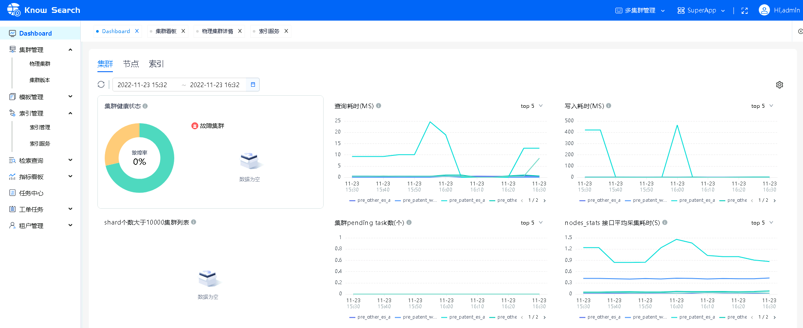
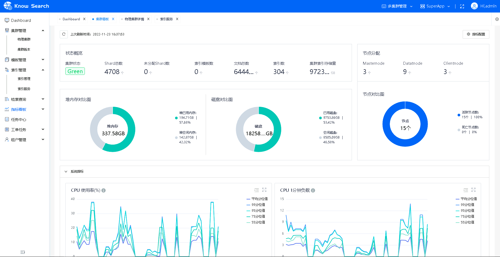
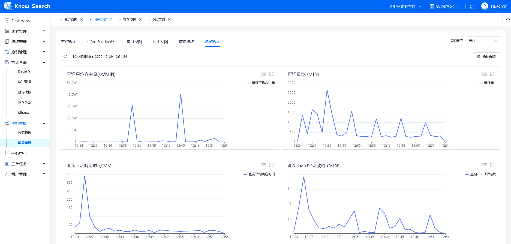
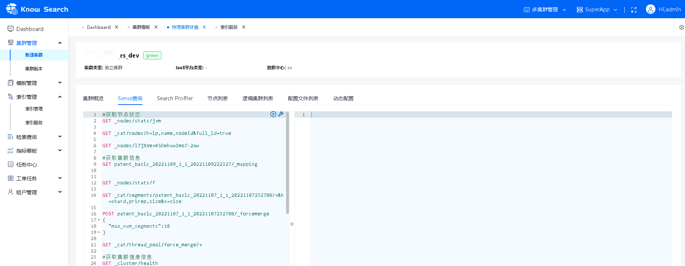
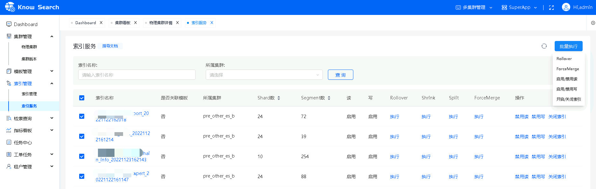

# 1.KnowSearch简介

KnowSearch是面向Elasticsearch研发与运维人员，围绕集群、索引构建的零侵入、多租户的Elasticsearch GUI管控平台。历经滴滴PB级海量索引数据考验、金融级1000+ES集群运营实战打磨，围绕Elasticsearch构建的可见、可管、可控的服务体系。

- 围绕ES用户，构建了自助服务体系
  - 量贩式集群/索引资源申请与管理
  - 低门槛数据建模
  - DSL/SQL灵活数据探查
  - 基于DSL查询模板，自助问题诊断

- 围绕ES运维，构建了场景化运维服务体系
  - 基于Dashboard集群问题主动发现
  - 基于集群看板高频问题快速诊断
  - 基于集群管理，存量5.X+版本集群全量纳管、高频集群与索引变更批量支持
  - 基于原生ES网关，零侵入、插件化的构建查询/写入限流、权限校验、跨集群访问、DSL查询模板分析与管控能力

# 2.KnowSearch特性

滴滴内部大量使用 ES 来支撑日志探查与安全分析、交易数据近实时检索、企业SKU搜索与推荐等业务场景的基础搜索服务。在开源 Elasticsearch 基础上提供离线索引快速导入、跨集群复制、索引模板服务的企业特性，平台整体具有以下特点：

- 5.X、6.X、7.X、8.X 众多主流Elasticsearch版本零侵入、统一纳管，多集群统一管理
- 集群、节点、索引维度，30+ 稳定性、性能风险点主动巡检，Dashboard统一呈现
- 集群、节点、索引维度，200+指标探查、同环比趋势分析、场景化指标筛选，助力问题高效诊断
- 应用视角、索引视角、查询模板视角、ClientNode视角 30+ 用户写入、查询网关指标同环比监控分析
- 集群动态配置管理、Sense 运维场景化命令集成、SearchProfiler集群慢查分析、集群快捷命令GUI集成
- 索引Mapping/Setting/别名管理、RollOver/Shrink/Split/FroceMerge/读写禁用高频操作GUI批量执行

# 3.KnowSearch产品图
DashBoard、集群看板、网关看板、集群管理、索引管理核心产品功能图如下：

# 4.文档资源

- [KnowSearch用户指南](doc/KnowSearch用户指南.md)
- [KnowSearch安装部署文档](doc/KnowSearch安装部署文档.md)
- [KnowSearch设计说明](doc/KnowSearch设计说明.md)
- [KnowSearch源码编译运行文档](doc/KnowSearch源码编译运行文档.md)
- [ElasticSearch最佳实践](doc/ElasticSearch最佳实践.md)
- [KnowSearch常见FAQ](doc/KnowSearch常见FAQ.md)

# 5.技术交流

微信加群：添加`mike_zhangliang`的微信号备注KnowSearch加群，加群之前有劳点一下 Star，一个小小的 Star 是对KnowSearch作者们努力建设社区的动力。
