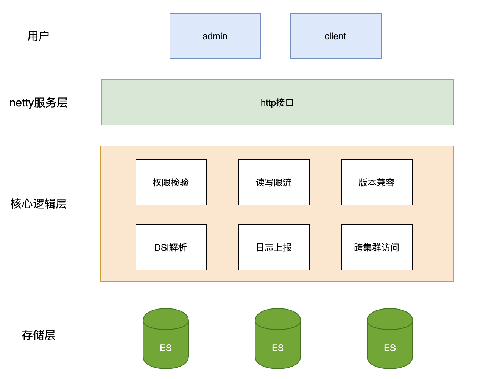
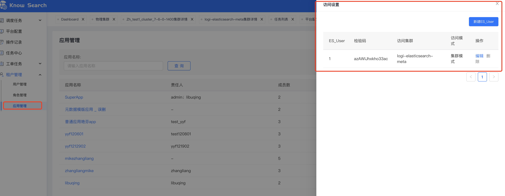
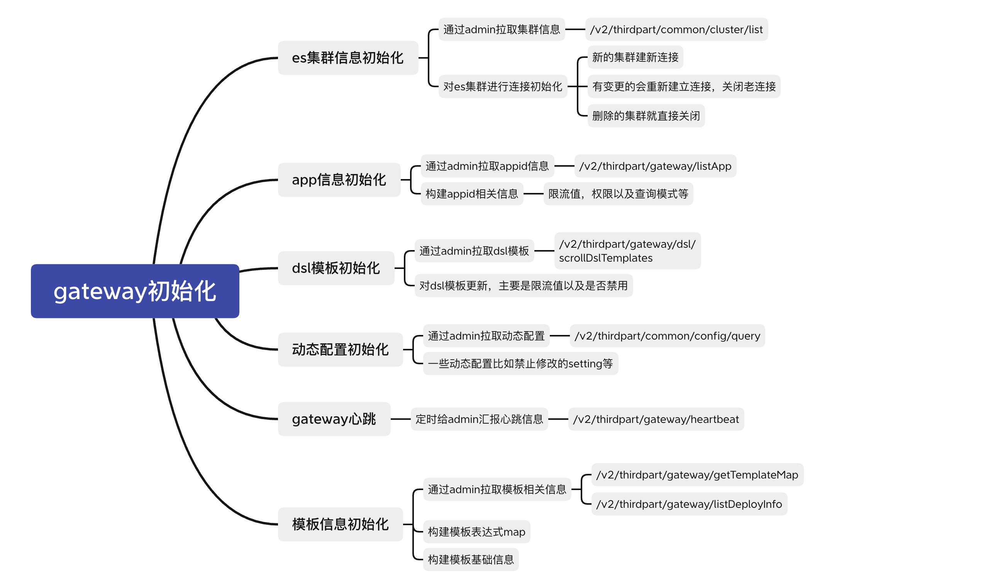
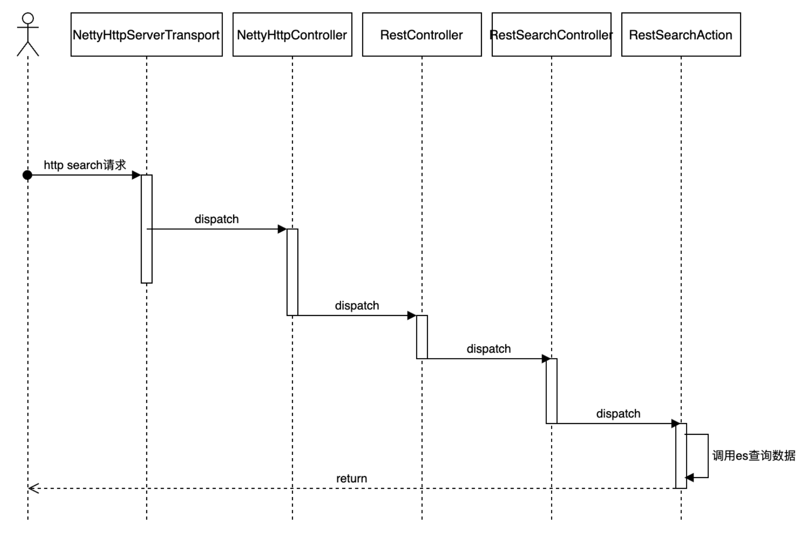
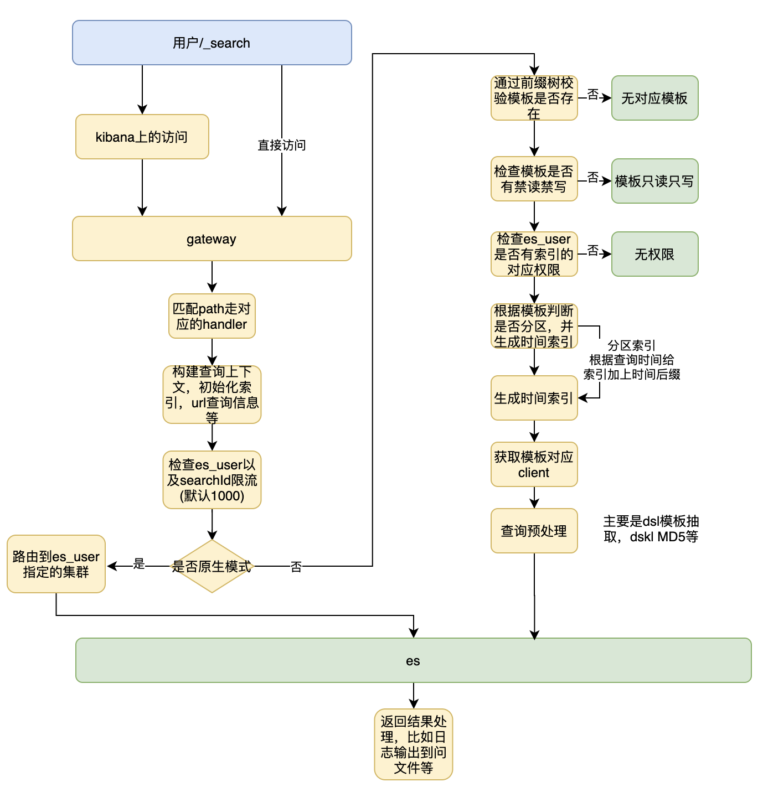
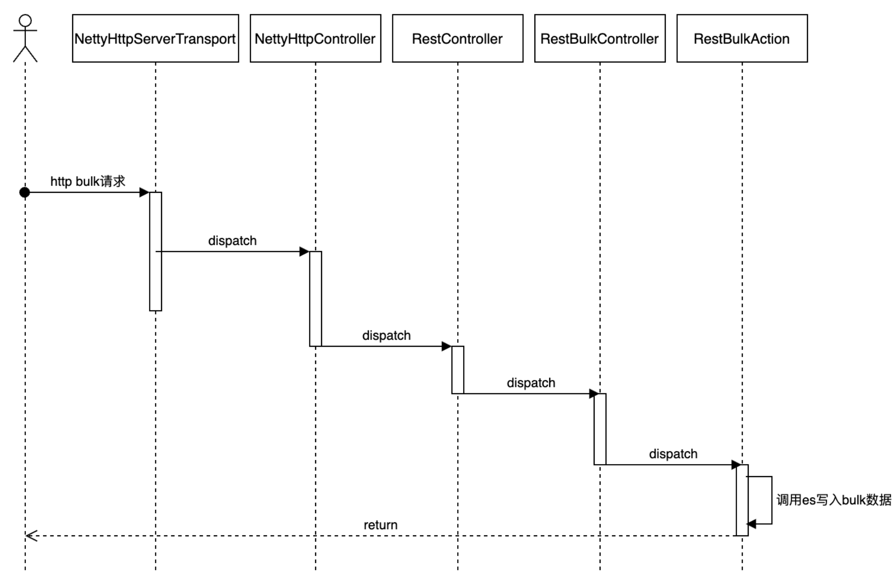
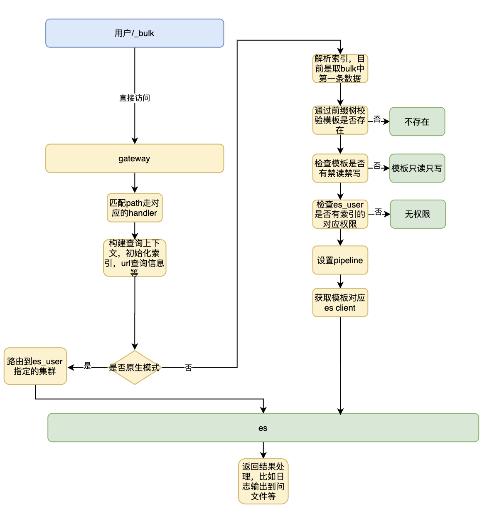

# 									Gateway设计文档

# 1.功能概述

​		Gateway是ES的数据网关，它提供了完全适配原生 ES RestClient 的接口功能，同时还提供了一些附加功能，如：查询/写入限流、权限校验、ES 版本兼容、跨集群访问。通过统一网关的建设，用户对 ES 的查询写入行为得到了监控和有效的控制，从而为后续索引级权限校验、集群跨版本升级、版本兼容、DSL 分析、查询写入限流提供了基础。

# 2.架构



# 3.前置概念

Gateway的三种访问模式

- 索引模式：会检验ES_USER以及模板相关权限（请求得带上索引模板），然后根据模板对应的具体集群进行请求路由
- 集群模式：会检验ES_USER以及模板相关权限（请求得带上索引模板），然后根据模板指定的集群进行请求路由

- 原生模式：会检验ES_USER，然后会根据ES_USER指定的集群路由请求，除了要加上ES_USER外其他跟直接访问ES没区别


三种模式的平台操作路径

- 应用管理-访问设置-新增ES_USER-选择访问模式



使用上面申请的ES_USER/ES_SECRET，在HTTP头域中增加ES_USER/ES_SECRET信息，即可按照指定模式访问Gateway。


Gateway中的特殊处理逻辑

- Gateway通过filebeats将访问统计日志写入KnowSearch元数据集群，在Admin中对KnowSearch元数据集群Gateway访问日志进行统计分析，形成网关看板的指标数据

- Gateway索引模式、集群模式下的bulk和index写都是采用DiDi-7.6.0-1400引擎的pipeline，注意📢：这里的bulk写的pipeline是bulk中的第一条数据为准，所以如果bulk中写不同的索引的话可能引发日期错乱的这种情况，所以索引模式下通过gateway bulk写的话，一批bulk必须是同一个索引

- Gateway索引模式下、集群模式下并不是所有ES的命令都支持，但是原生模式是支持的

- Gateway拉取admin的元数据，目前是全量拉取，每隔1分钟会拉取一次

- Gateway索引模式、集群模式下的bulk和update以及delete对时间格式的处理上会有所不同，bulk使用pipeline处理的，update和delete是gateway里面处理的，pipeline只支持一种时间格式，update支持多种时间格式，有这么一个区别要注意下


# 4.DiDi-7.6.0-1400引擎pipeline处理逻辑

arius平台的每一个模板，都会对应一个pipeline，这个pipeline主要做3件事

- 对写入的索引，根据时间字段以及类型，加上对应的时间后缀【原索引admin，经过pipeline处理后变成admin_2020-01-10】
- 对写入进行限流，例如下面就是限流每秒100万，注意这个限流是单机限流
- 过期的数据丢掉，例如下面就是60天之前的数据丢弃，还有默认未来3天后的数据也会丢弃

默认的逻辑

- 写入的时间字段格式要和pipeline一一对应
- 如果写入数据的时间字段格式和pipeline配置对不上，那么不会报错，会写入到当天索引

```
{
  "arius_stats_dashboard_info" : {
    "description" : "arius_stats_dashboard_info",
    "processors" : [
      {
        "throttle" : {
          "rate_limit" : 1000000
        },
        "index_template" : {
          "index_version" : 0,
          "field" : "timestamp",
          "index_name_format" : "_yyyy-MM",
          "expire_day" : 60,
          "field_format" : "UNIX_MS"
        }
      }
    ]
  }
}
```


# 5.层级代码

gateway接受请求的方式，参考了es的代码，用的netty去处理的

gateway的代码层级

- Arius-gateway-common       通用层，一些工具实体类
- Arius-gateway-core               业务处理层
- Arius-gateway-remote          第三方服务，目前是空
- Arius-gateway-rest                rest请求入口
- Arius-gateway-task               目前是空


# 6.gateway初始化



# 7.核心功能

## 7.1dsl限流

- 获取dsl模板元数据信息
- 解析查询dsl模板，限流校验
- 本地内存记录查询dsl模板的详细统计信息
- 每隔一分钟上报dsl模板信息到元数据集群

## 7.2日志上报

- 查询写入请求过来
- 把请求的日志串一起放到joincontext中
- 请求结束，将日志打印到文件中
- filebeat自动采集日志到元数据集群
- Gateway指标相关就能展示了

## 7.3管控限流

- es_user层面的读取限流
- es_user层面的模板管控

# 8.读写流程

## 8.1 读时序



## 8.2 读流程



## 8.3 写时序



## 8.4 写流程




# 9.异常

## 9.1 Gateway查询相关的异常

| 异常                       | http错误码 | 说明                                                         | 解决方法                                          |
| :------------------------- | :--------- | :----------------------------------------------------------- | :------------------------------------------------ |
| UriNotFoundException       | 404        | 查询gateway的uri不对，gateway仅支持ES查询相关的方法，其他方法会返回该错误 | 确认需求的合理性                                  |
| UnauthorizedException      | 401        | 认证信息不正确                                               | 确认es_user对应的pass是否正确                     |
| SQLNotPermittedException   | 403        | Gateway只支持SELECT的SQL，其他的SQL语句会返回该异常          | 确认是否需要其他SQL的支持，以及如何支持           |
| QueryDslLengthException    | 400        | 查询的DSL语句超过指定长度，目前设置的长度上限是10M           | 应用方确认查询语句过长原因，调整需求              |
| InvalidParameterException  | 400        | 传递的参数不合理，错误时会附加描述信息，告知是哪部分的错误   | 应用根据错误提示，结合Gateway文档确认参数异常问题 |
| InvalidAppInfoException    | 400        | appid不存在                                                  | 确认认证信息是否有异常                            |
| IndexNotPermittedException | 403        | 每个appid都只能访问该appid指定访问的索引列表，如果出现访问的索引不在允许的索引列表中，就会返回IndexNotPermittedException | 确认是否要增加该索引的访问权限                    |
| IllegalArgumentException   | 400        | 例如java.lang.IllegalArgumentException: No feature for name [_search] 请求的uri=//_search，没有传入索引名称 | 修改索引名称                                      |
| FlowLimitException         | 503        | 查询ES索引频率过高，被gateway限流，会出现部分访问失败，返回FlowLimitException，随着访问频率不断增高，限流概率会越来越大 | 讨论访问的qps，确认是否要增大限流参数             |
| DslRateLimitException      | 400        | gateway dsl审核功能，会对用户的查询访问进行限流，用户查询时会报出DslRateLimitException | 确认需求的合理性                                  |
| DslForbiddenException      | 403        | gateway dsl审核功能，会禁止某些异常的查询访问，用户查询时会报出DslForbiddenException | 确认需求的合理性                                  |
| AggsParseException         | 400        | gateway会禁止掉对基数过大的字段做聚合查询，报出AggsParseException的异常， 复杂的聚合查询会导致ES数据节点、查询节点内存打满，而影响正常使用，需要禁止该复杂查询。 | 确认需求的合理性                                  |
| AccessForbiddenException   | 403        | 禁止访问ES索引数据，一般是没带上认证信息导致的异常           | 申请认证信息，或者确认认证信息如何生效            |

## 9.2 ES查询相关的异常

| 异常                          | http错误码 | 说明                                                         | 失败范围                  | 解决方法                                                     |
| :---------------------------- | :--------- | :----------------------------------------------------------- | :------------------------ | :----------------------------------------------------------- |
| 异常                          | http错误码 | 说明                                                         | 失败范围                  | 解决方法                                                     |
| EsRejectedExecutionException  | 429        | 查询过于频繁，es拒绝该查询请求                               | shard级别，会返回部分数据 | 应用方确认是否查询频率过大，或者查询语句过于复杂，阻塞了其他的查询 |
| SearchParseException          | 400        | 查询的dsl语句不合法                                          | 整体失败                  | 应用方确认查询的语句异常                                     |
| NoNodeAvailableException      | 503        | ES节点全部离线，持续出现该问题是非常严重的，应用需及时跟Arius团队联系 | 整体失败                  | 确认配置的节点信息，定位出现该异常的原因                     |
| IndexNotFoundException        | 404        | 查询的索引不存在                                             | 整体失败                  |                                                              |
| SearchPhaseExecutionException | 503        | 查询语句异常，例如NumberFormatException[For input string: "210_28647510026308815217104323841494461"]传入的参数不为数字 | 整体失败                  | 应用方确认查询的语句异常                                     |
| ElasticsearchParseException   | 400        | 查询语句异常，ElasticsearchParseException[failed to parse date field [NaN-0NaN-0NaN 0NaN:0NaN:0NaN] with format [yyyy-MM-dd HH:mm:ss]] | 整体失败                  | 应用方确认查询的语句异常                                     |
| QueryPhaseExecutionException  | 500        | QueryPhaseExecutionException[Result window is too large, from + size must be less than or equal to: [10000] but was [10050]查询语句中from+size的值大于最大窗口值1万条 | 整体失败                  | 如果要获取超过1万条之后的数据，需要使用scroll方式            |