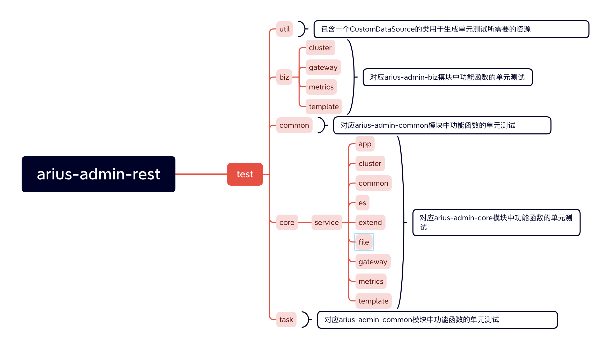
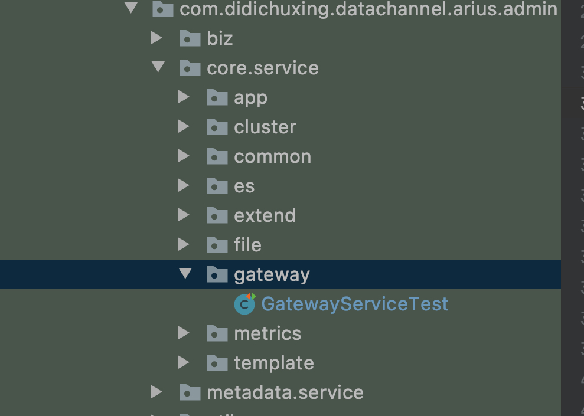

KnowSearch团队结合滴滴内部项目经验编写了单元测试规范文档，阅读本文档，您可以了解到KnowSearch项目的单测开发规范。

# 1.功能概述

## 1.1 需求整体介绍

### 1.1.1 单元测试定义及作用

#### 单元测试定义

单元测试，是指对软件中的最小可测试单元进行检查和验证，是开发者编写的一小段代码，用于检验被测代码中的一个很明确的功能是否正确。通常而言，一个单元测试是用于判断某个特定条件（或者场景）下某个特定函数的行为。

#### 单元测试作用

程序中的每一项功能都能靠单元测试测试来验证它的正确性及其是否符合我们的期望。单元测试为以后的开发提供支援。在开发后期，可以依靠单元测试增加功能或更改程序结构，而不用担心这个过程中会破坏重要的东西，并且单测为代码的重构提供了保障，可以使得程序员更自由的对程序进行改进。

### 1.1.2 Knowsearch项目中编写单元测试的目的

本次单元测试开发旨在通过单元测试对com.didichuxing.datachannel.arius.admin.core层中的核心业务所对应的方法的功能函数在不同条件下的不同分支是否能够返回程序预先设定的在不同条件下的返回值，以减少Knowsearch项目的bug提升代码质量。并**通过**一定的**测试覆盖率**标准来**检验该单元测试**是否符合标准。

## 1.2 功能模块梳理

整个单元测试模块放至arius-admin-rest模块的test文件夹下，**模块框架图**如下:   



单元测试放在test文件夹下，根据所需测试的功能函数所在模块和包，将单元测试放在test对应的文件夹下。单元测试所对应的类**命名规范为xxxTest**(其中xxx为该单元测试所对应的功能接口)，在util包中的CustomDatasource类中存储单测所需要的各个资源，所对应的函数命名方式为xxxFactory(其中xxx对应所需要的资源的类名)。

## 1.3 单元测试标准

- 针对项目中的com.didichuxing.datachannel.arius.admin.core模块进行测试，经过统计，core模块中核心业务所对应的方法**平均圈复杂度(Cxty)为2.07**，因此**当方法的圈复杂度(Cxty)大于等于2时需要**对该方法进行**单元测试**。

    **注：圈复杂度简单的说就是为了覆盖所有路径，所需要执行单元测试数量，圈复杂度大说明程序代码可能质量低且难于测试和维护。**

- 对于每一个测试我们**需要对其覆盖率进行核验**，其中测试覆盖率包含了类覆盖率，方法覆盖率，行覆盖率，分支覆盖率等，本项目中的单元测试主要**查看对应的行覆盖率**。

  注:行覆盖率根据单测所对应的功能需求而定，**针对框架代码**我们可以要求覆盖率低一些，**50%即可，能覆盖主逻辑**。而**针对核心逻辑代码**的覆盖率自然越高越好，需要达到**代码测试覆盖率**为**80%及以上**。 

### 1.3.1 测试覆盖率

#### 定义

测试过程中根据需求文档和设计文档编写测试用例、执行测试；为了更加全面的覆盖，我们可能还需要理解被测程序的逻辑，需要考虑到每个函数的输入与输出，逻辑分支代码的执行情况，这个时候我们的测试执行情况就以代码覆盖率来衡量。覆盖率是衡量测试效果的一个辅助指标。

#### 作用

测试覆盖率一方面可以衡量测试工作本身的有效性，提升测试效率，一方面可以提升代码质量，减少bug，提升产品的可靠性，稳定性。 

### 1.3.2 测试覆盖率工具jacoco

#### jacoco定义以及作用

Jacoco的出发点是为基于JVM运行的代码提供代码覆盖率统计，期望提供轻量级的、可伸缩的、文档较全的库文件来集成各类构建和开发工具。 

#### knowsearch项目中如何使用jacoco

**通过jacoco进行单测的代码覆盖率检验以及分支覆盖情况**。

jacoco通过maven命令行来生成代码覆盖率报告。 执行maven命令:mvn clean test org.jacoco:jacoco-maven-plugin:0.8.3:prepare-agent install -Dmaven.test.failure.ignore=true

**具体报告实例详见Test举例,jacoco报告所包含内容及代码覆盖三种情况如下所示。**

**jacoco报告所包含的内容如下：**

- **Instructions:** Java 字节指令的覆盖率。执行的最小单位，和代码的格式无关。

- **Branches**: 分支覆盖率。注意，异常处理不算做分支。

- **Cxty(Cyclomatic Complexity)**: 圈复杂度, Jacoco 会为每一个**非抽象方法**计算圈复杂度，并为类，包以及组（groups）计算复杂度。圈复杂度简单的说就是为了覆盖所有路径，所需要执行单元测试数量，圈复杂度大说明程序代码可能质量低且难于测试和维护。

- **Lines**: 行覆盖率，只要本行有一条指令被执行，则本行则被标记为被执行。

- **Methods**: 方法覆盖率，任何非抽象的方法，只要有一条指令被执行，则该方法被计为被执行。

- **Classes**: 类覆盖率，所有类，包括接口，只要其中有一个方法被执行，则标记为被执行。注意：构造函数和静态初始化块也算作方法。

**jacoco代码覆盖报告中包含了以下三种情况：**

- **没有覆盖**：这⼀⾏中没有指令被执⾏（**红⾊背景**）

- **部分覆盖**：这⼀⾏中只有⼀部分指令被执⾏（**黄⾊背景**）

- **完全覆盖**：这⼀⾏中所有指令都被覆盖（**绿⾊背景**）

### 1.3.3 单元测试中mock的使用

由于启动web工程带来的开销较大，因此单元测试中**采用mock**来**构建数据库依赖进行模拟**，以保证系统的测试流程可以正常运行，即生成一个和实际使用场景不一样的对象。

**调用mock对象的方法时，不会执行真实的方法**，而是返回类型的默认值，如object返回null, int返回0等，**可以通过指定when(方法).thenReturn(value)来指定方法的返回值。**代码实例如下：

```
public class GatewayServiceTest {

    //通过@Mock构造该单元测试所需mock的对象
    @Mock
    private GatewayClusterDAO gatewayClusterDAO ;
    @Mock
    private GatewayClusterNodeDAO gatewayClusterNodeDAO;
    @Mock
    private Set<String> clusterNames;
    @Mock
    private AppService appService ;
    @Mock
    private ESGatewayClient esGatewayClient ;
    //单元测试对应方法进行mock注入
    @InjectMocks
    private GatewayServiceImpl gatewayService;

    @BeforeEach
    void setUp() {
        initMocks(this);
    }
    @Test
    void heartbeatTest1() {
        // 生成新的记录
        GatewayHeartbeat gatewayHeartbeat = gatewayHeartbeatFactory();
        //通过Mockito.when().thenReturn()返回所需要的与数据库关联的对象的返回值
        when(gatewayClusterDAO.insert(Mockito.any())).thenReturn(1);       when(gatewayClusterNodeDAO.recordGatewayNode(Mockito.any())).thenReturn(1);
        Assertions.assertTrue(gatewayService.heartbeat(gatewayHeartbeat).success());
    }
}
```

### 1.3.4 test举例

以arius-admin-core-service模块下的GatewayService接口的为例。GatewayService接口所对应的单元测试函数命名为GatewayServiceTest，放至所对应的com.didichuxing.datachannel.arius.admin.core.service.gateway包中如图所示。



这里以其中的Result<Void>heartbeat(GatewayHeartbeat heartbeat)功能函数作具体讲解。heartbeat函数所对应的返回分别有**成功，保存失败以及传入参数无效三种情况**，heartbeat函数对应代码如下。

```
@Override
public Result<Void> heartbeat(GatewayHeartbeat heartbeat) {
    Result<Void> checkResult = checkHeartbeat(heartbeat);
    if (checkResult.failed()) {
        return checkResult;
    }

    if (!recordHeartbeat(heartbeat)) {
        return Result.buildFail("save db fail");
    }

    if (!clusterNames.contains(heartbeat.getClusterName())) {
        saveGatewayCluster(heartbeat.getClusterName());
    }

    return Result.buildSucc();
}
```
因此所编写单元测试需要分别检验成功返回(Result.buildSucc())以及不同错误的返回分支以便能成功覆盖所对应功能函数的全部代码。所对应函数如下：


运行单元测试，生成该单元测试所对应的jacoco的代码覆盖报告如下：可以看出该方法的单元测试基本覆盖方法的所有行以及80%以上分支。 


# 2.代码及模块规范

- 代码符合web工程规范

- 模块规范参考模块框架图

- 单元测试的代码覆盖率标准以及jacoco的使用详见单元测试标准一小节。`