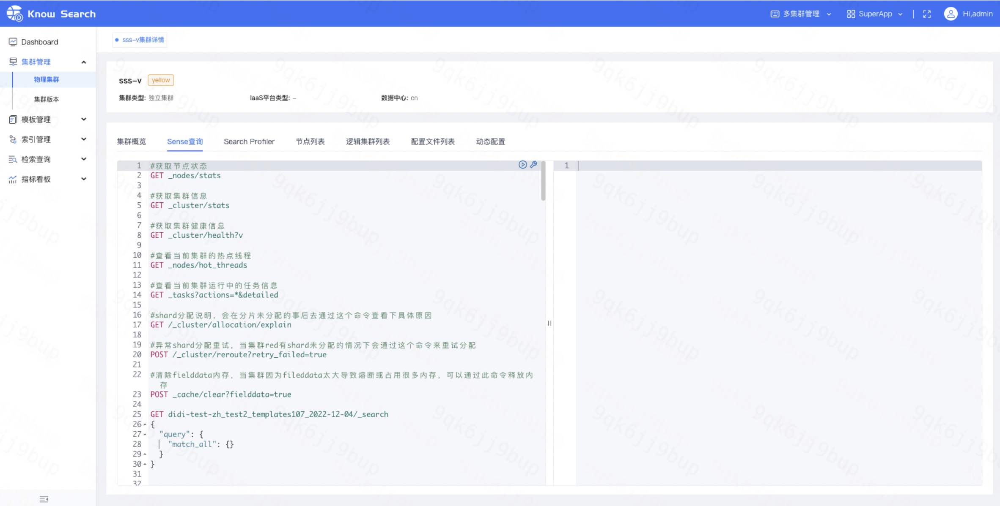
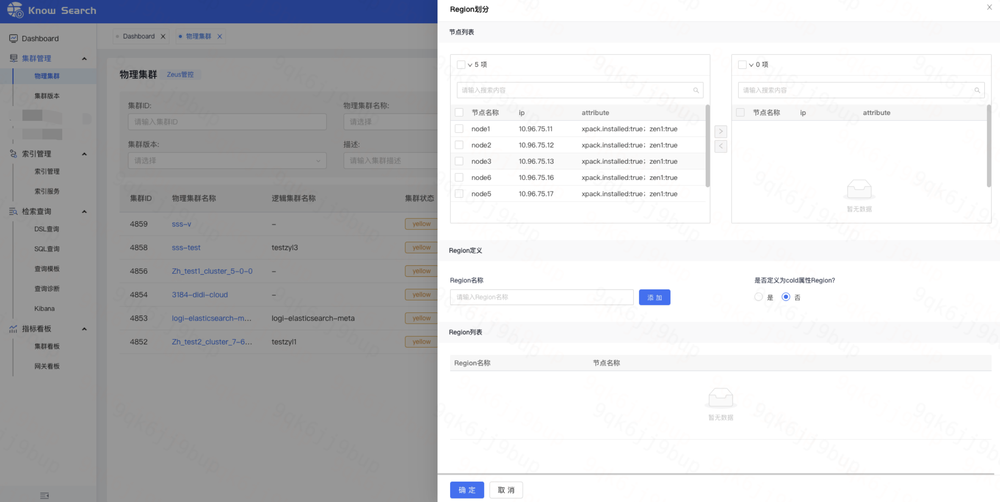
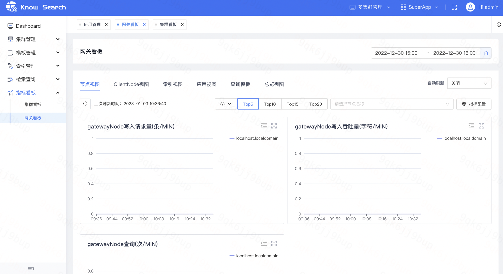
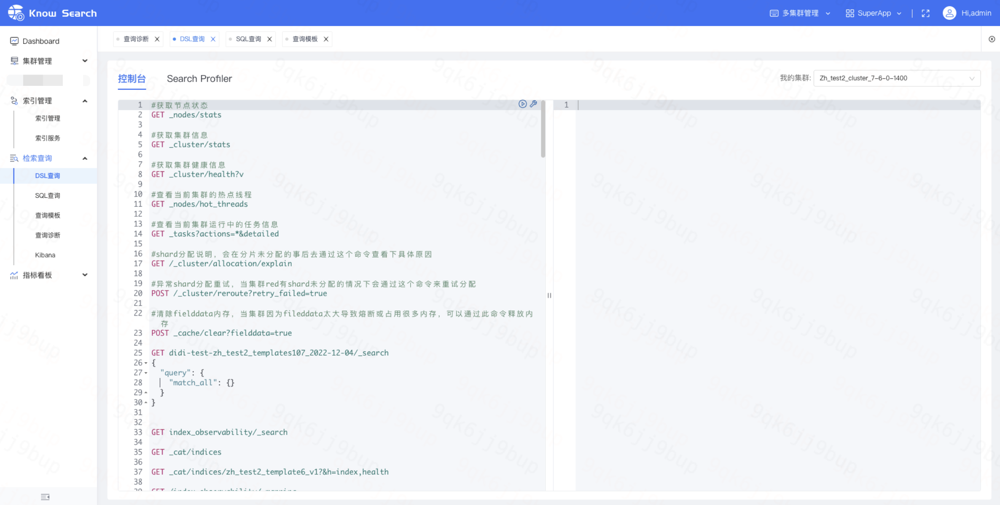

# 1.概述

通过阅读此文档，您可以了解到KnowSearch的一些基于滴滴最佳实践的概念说明以及平台侧一些高频及重点操作的使用方法。以便您可以通过便捷的接入方式快速体验ES集群指标监控与运维管控的全流程。

# 2.概念说明

## 2.1 Region

为解决物理资源利用率的问题及实现租户隔离，抽象出物理集群--逻辑集群的双层架构模型，将物理集群的节点资源以region的形式划分并与租户的逻辑集群进行绑定，这个概念会在后面的场景化介绍中进行详细阐述。

## 2.2 租户

### 2.2.1 应用

为了保障租户的信息和数据安全，以应用为单元进行资源管理（这里的应用可以理解为不同的业务线，对资源的权限是相互隔离的），以ES_User作为媒介进行鉴权，实现多租户数据权限隔离，同时利用不同的应用去区分资源权限，KnowSearch会预置一个SuperApp提供给平台全部管理员进行物理集群的运维纳管；并且会预置一个元数据应用作为管理元数据集群的资源信息。

### 2.2.2 角色

基于标准租户权限模型，以不同角色实现页面资源的权限分配，提供预置两类角色：管理员、资源Owner，并支持自定义角色设置。其中管理员角色比较特殊，属于管理员角色的用户会成为平台全部应用的一员。

### 2.2.3 责任人

责任人作为应用资源的负责人，可用于对接监控告警或信息通知模块。可以理解为应用中的一类特殊成员。

## 2.3 集群类型

在物理集群侧定义了集群类型这个概念，用以区分物理集群到逻辑集群的划分关系，其中涵盖三种类型：独立集群、独享集群、共享集群；
- 独立集群：支持集群层面的数据隔离（物理集群的全部节点划分为一个Region，并将此Region分配给一个逻辑集群，这样物理集群与逻辑集群是一对一的）
- 独享集群：支持数据节点层面的隔离（物理集群下的数据节点会划分为多个Region，每个Region只会被一个逻辑集群绑定）
- 共享集群：数据共享（物理集群下的数据节点会划分为多个Region，每个Region会进行多次分配，既每个Region会被多个逻辑集群绑定）

## 2.4 ES_User

ES_User及校验码作为访问网关的用户名和密码，每个应用至少需要一个ES_User及校验码进行ES集群访问与查询
访问模式分为三种：集群模式、索引模式和原生模式
- 集群模式：会检验appid以及模板相关权限，然后根据appid指定的集群路由请求
- 索引模式：会检验appid以及模板相关权限，然后根据模板对应的具体集群路由请求
- 原生模式：会检验appid，然后会根据appid指定得集群路由请求，就充当路由功能，然后所有请求都会转发给es，除了要加上appid外其他跟直接访问es基本没区别

## 2.5 工单

工单模块分为资源申请及资源审批两部分组成，普通用户根据所需申请资源以及对自身资源的扩缩会生成对应工单，管理员通过审批流程完成资源的分配。针对平台普通用户对于资源的重大变更操作同样支持通过工单审批完成。

# 3.重点场景介绍

通过预置的两类角色：管理员、资源owner区分运维人员和普通用户，以下将通过两类角色的体验路径进行逐一介绍产品功能

## 3.1 运维管理员

安装部署好KnowSearch后，管理员用户需要对物理资源进行统一接入管理，通过“应用”做好对应的资源分配与用户管理。

### 3.1.1 接入集群

如下图所示，进入集群管理-->物理集群，点击【接入集群】，填写集群基本信息。
- 集群名称：支持大小写字母、数字、-、_、1-32位字符
- 录入规则：自动获取可以通过添加单个可接入节点进行集群接入；全量录入可添加全量集群节点（包括离线节点）
- 高级选项：集群类型默认独立集群；数据中心默认为空，可前往【平台配置】查看对应配置：cluster.data.center_list；IaaS平台类型默认为空，可前往【平台配置】查看对应配置：cluster.resource.type_list；账户名、密码默认为空，若集群设置了密码可自行添加。

### 3.1.2 集群运维

物理集群接入后，可通过集群快捷命令进行快速运维

- 快捷命令包含一些高频的集群运维指令，可实现集群的node_state分析、indices分析、shard分布、pending task分析、task任务分析、热点线程分析

- 点击集群名称，进入集群详情，可进行集群基础信息的查询

- 除查看物理集群的基本信息外还包含对于物理集群的sense查询及动态配置变更

### 3.1.3 资源划分

- 物理集群的region划分及扩缩容
 - Region划分：点击物理集群列表操作列中的【Region划分】，选择对应的数据节点并定义好Region名称完成对物理资源的划分，这里的操作需要为后续的逻辑集群划分做准备。

 

 - Region管理：点击物理集群列表操作列中的【Region管理】，可选定对应Region并进行Region的扩缩容

### 3.1.4Dashboard与指标看板运维

KnowSearch 提供了多种维度的指标采集和展现能力，针对集群、索引、节点提供全面的指标监控体系，实时掌握集群性能及业务情况。
首页的Dashboard与菜单中的指标看板模块组合起来的指标运维体系是基于滴滴多年的运维经验进行提炼整合的一整套解决方案，其中指标含义及计算方式详见指标字典：（指标字典地址）。另外还提供了针对网关的指标监控体系，将用户通过网关访问ES的行为中提炼有运维价值的指标信息进行分类展示。

- Dashboard模块是全平台纳管资源视角，根据典型运维场景，从集群、节点、索引三个维度整合出对应的风险预警指标，通过预警指标发现问题。
- 每项指标均会注明指标价值及计算逻辑并支持选择Top5-Top50

- 每项指标对象均支持跳转到对应的指标看板，以集群为例，点击某一集群对象，可跳转集群看板查看详细指标数据

- 进入集群看板后，可以根据自身需要进行灵活的指标配置，我们也提供不同维度的指标聚合，支持Top级指标查看（举例：如选择Top5，则会展示当前时间点指标值为Top5的指标分布情况）、最长七天时间回溯展示、黄金指标一键配置。

- 同时我们也提供多维度的指标查看，其中包含总览视图、节点视图、索引视图
总览视图是对选定集群概览信息的指标整合，如索引数、shard数、节点组成及状态、内存占用等集群基本信息；同时将指标细分为系统指标、性能指标及状态指标，见下图。

- 节点视图是对选定集群节点指标信息的整合，细分为以下六类：系统指标、进本性能指标、高级性能指标、JVM指标、Breaker指标、内存大小指标

- 索引视图是对选定集群索引指标信息的整合，细分为以下三类：索引基础指标、索引性能指标、索引内存指标

### 3.1.5网关指标查看

KnowSearch将每一项通过网关进行访问的指标进行提炼整合，围绕网关的指标监控体系提供了多维度指标查看，其中分为节点视图、clientnode视图、索引视图、应用视图、查询模板、总览视图。支持Top级指标查看，最长七天时间回溯展示。

### 3.1.6多应用创建及租户分配

以预置管理员账户（admin/admin123）登录KnowSearch平台后，该用户属于SuperApp，然后前往【租户管理】-->【应用管理】，点击【新建应用】进行应用创建。

- 创建应用时，需要把相关用户绑定到新建的应用下，这样，应用下全部用户对于资源的权限都是一致的；或者在已有应用的列表中点击【编辑】进行用户添加。

- 应用创建好后，该应用下的用户就可以进行资源申请了

### 3.1.7工单审批

管理员用户接收到普通用户提交的资源申请工单后需要进行资源审批，以集群申请为例，集群类型与数据节点规格需要严格一致，节点数需要大于等于申请节点数

## 3.2 普通用户

普通用户登录KnowSearch后，如果没有应用，需要自己去创建应用，用于后续的资源管理。拥有应用的用户可以直接进行资源申请操作。（注：资源Owner为默认角色，用户注册后默认是资源Owner角色）

### 3.2.1 申请集群资源

- 普通用户登录平台，选择对应应用，前往【集群管理】-->【我的集群】
- 点击【申请集群】，填写集群申请表单
 - 集群名称：支持大小写字母、数字、-、_、1-32位字符
 - 集群版本：平台纳管的全部物理集群的版本信息
 - 集群类型：根据所需进行选择
 - 业务等级：主要是为了标记承载业务的重要程度，这里分为核心、重要、一般
 - Datenode：平台纳管的全部物理集群的数据节点规格信息，根据所需进行选择

 

### 3.2.2 集群资源管理

集群资源申请成功后，会在我的集群侧新增一条数据项，可进行集群扩缩容的申请及集群下线。

 

点击集群名称可查看集群详情及绑定的节点信息。

 

### 3.2.3 索引资源管理

进入索引管理，如下图所示，可进行索引创建、编辑Mapping、编辑Setting、设置别名、下线，此处的索引列表包括全平台全部的索引。

 

- 索引创建需要定义好索引名称并选定创建的集群，设置好Mapping、Setting后即可完成创建（其中Mappign和Setting的内容提供填写示例及官方指导）

 
 
- 注：索引创建前应用内必须存在集群资源，若无集群资源需前往【我的集群】进行资源申请

### 3.2.4查看集群指标信息

KnowSearch为普通用户也提供了完善的指标观测体系，其中分为索引视图、总览视图、节点视图三个视角，用户可以根据自身需要进行灵活的指标配置，我们也提供不同维度的指标聚合，支持Top级指标查看（举例：如选择Top5，则会展示当前时间点指标值为Top5的指标分布情况）、最长七天时间回溯展示。

# 4.其他功能介绍

## 4.1 索引管理与服务

进入索引管理，如下图所示，可进行索引创建、编辑Mapping、编辑Setting、设置别名、下线，此处的索引列表包括全平台全部的索引。

- 索引创建需要定义好索引名称并选定创建的集群，设置好Mapping、Setting后即可完成创建（其中Mappign和Setting的内容提供填写示例及官方指导）

- 编辑Mapping、Setting同上
- 除基础信息变更外还提供别名设置能力，为后续的rollover等能力提供服务

进入索引管理-->索引服务，如下图所示，可针对平台索引进行索引管控运维操作，这里包含Rollover、Shrink、Split、ForceMerge及对索引读写的启用/禁用等基础变更能力。

## 4.2 检索查询

为了在DSL语句级别保障查询公共资源的稳定性，KnowSearch 服务会进行DSL的分析、管控和限流。KnowSearch 会记录用户的查询语句，并对查询语句进行模板抽象，进而分析出用户查询特点(查询次数，查询耗时分位等信息)。进入检索查询-->DSL查询进行操作。
- DSL查询会提供常用的默认查询语句，历史查询记录也会被记录，以便保留高频的查询语句。
- 右上角可进行集群对象选择

- 异常分析：如下图所示，提供DSL模板的异常查询和慢查询列表的查看以及异常原因的展示
 - 慢查询语句：查询请求到达gateway，gateway会记录一个请求时间，gateway处理完相关业务后请求响应前为当前时间，如果当前时间-请求时间大于一秒，则视为慢查询语句。

 

 - 注：慢查询时间阈值可在应用管理侧进行配置，支持应用级慢查设置。（应用管理-->编辑）

  

 - 异常查询语句：这里分为触发ES查询异常和触发gateway异常，ES查询异常包括：查询不存在索引或文档、scroll查询上下文过大或json_parse_exception；触发gateway异常包括：appid粒度的限流触发、dsl查询模版粒度的限流触发、索引对应的模版不存在、appid不存在、appid权限校验失败等等。

   

## 4.3 工单申请及审批

普通用户的资源变更操作会生成对应工单，管理员通过工单进行资源的审批及分配。
- 进入工单任务-->我的审批可查看全部可审批工单

 

- 点击工单名称可查看工单详情并进行审批操作，以集群申请工单为例，通过该项工单需进行根据用户需要进行资源分配。

 

## 4.4 租户管理

租户管理分为用户管理、角色管理、应用管理
- 用户管理：展示全平台全部的用户，可进行用户的增删及角色分配

 
 
- 角色管理：展示全平台全部角色，可进行角色的增删及用户分配。注：这里会预置两类默认角色：管理员和资源Owner作为区分运维管理员及普通用户；后续新增的角色也会基于资源Owner去做扩展。

 

- 应用管理：展示全平台全部应用，可进行角色的增删及访问设置操作。注：这里会预置一个默认应用SuperApp，SuperApp默认与管理员角色的用户强绑定，既SuperApp下的用户仅为管理员用户。

 

## 4.5 平台配置及调度任务

平台配置说明：平台配置的功能主要用于对于整个平台而言相对重要通用，且需对外提供可选操作的属性，按照配置组和配置名称进行分类别的的配置，提供灵活的配置能力。例如常规配置组别下的黑名单控制权限，对于资源管控中cpu占用率的设置，冷热存的天数设置等等。

调度任务说明：KnowSearch 中业务需要定时来调度执行，比如：定时提前创建模板对应的分区索引、定时清理过期的索引等操作。KnowSearch 中的调度任务是平台的核心依赖，建议在阅读该说明前，可以先仔细阅读 KnowSearch 的架构设计和业务说明。

## 4.6 操作记录

全平台数据变更操作记录，可用于后期审计。

