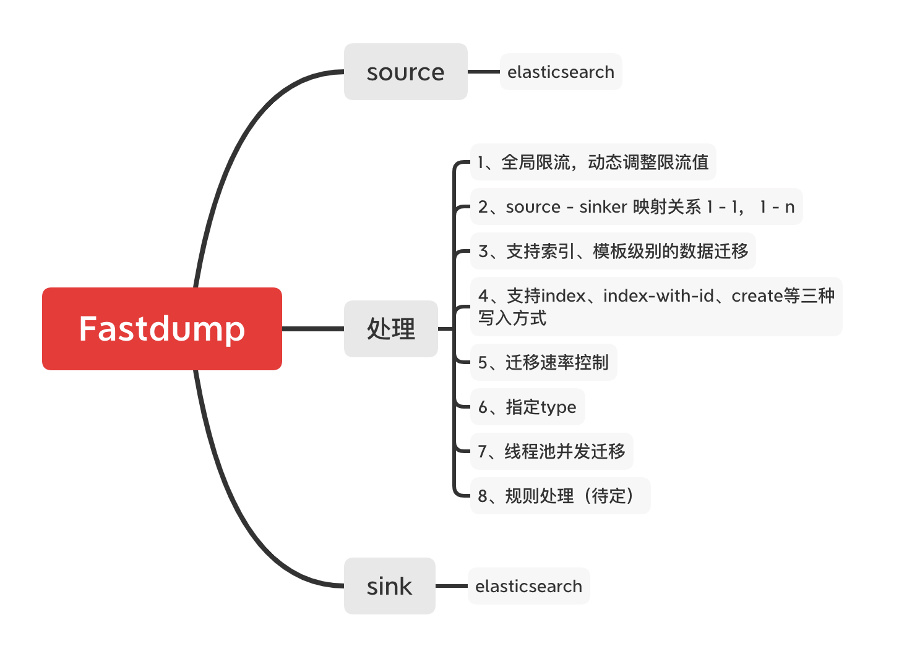
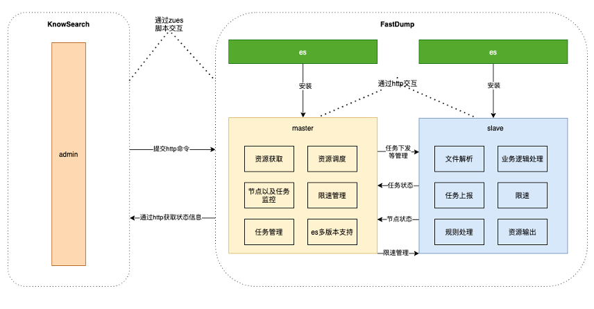
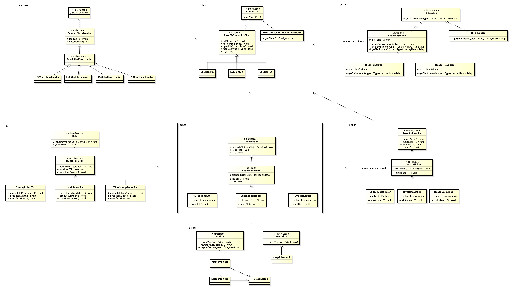

# 一、背景

随着Elasticsearch版本的高速迭代, 且各Elasticsearch企业内核版本繁多(2.x ~ 8.x), 运维的复杂度极高, 统一版本带来的升级工作显得尤为迫切, 
Fastdump作为轻量级、易扩展、极快的离线迁移的工具应运而生，目前支持2.x 5.x 6.x 7.x 到 5.x 6.x 7.x 8.x 任意版本间的离线数据迁移。
此外，针对Elasticsearch日常的运维能力，如Shard变更，离线数据快速迁移，数据压测等使用频次较高的能力，Fastdump一并支持。

# 二、方案设计

## 01 架构图

## 02 实现流程

1、每个es都会运行一个fastdump进程，常驻；

2、依赖注入使用Springboot框架，但是剥离掉springboot - web层, 使用netty；

3、所有的通信交互都是通过http请求；

4、FastDump进程，通过自定义类加载器，完成对es多版本的支持，而不是每个版本的es提供一个jar；

5、增加模板级别数据迁移；

6、增加节点级别限流

7、任务状态上报，主要是完成的资源情况以及当前处理的速率

## 03 核心UML类图

# 三、展望&扩展点

## 01 同版本 lucene 文件拷贝

核心思路：

a. 索引信息解析： 获取索引主shard所在节点信息 

b. 单节点Lucene文件读取：同版本lucen index 文件 BufferReader读取

c. 拷贝目标端路由节点计算： 在fastdump的 master角色中计算源端节点到目标端节点的路由计算逻辑（需要考虑_routing计算场景，参考es shard路由计算逻辑：https://www.elastic.co/guide/en/elasticsearch/reference/current/mapping-routing-field.html）。

d. 对端写逻辑： 对拷逻辑需要过滤集群索引状态文件（indices/_state文件），其他文件对拷即可。

e. 任务状态开发： 同版本拷贝任务状态记录开发。

