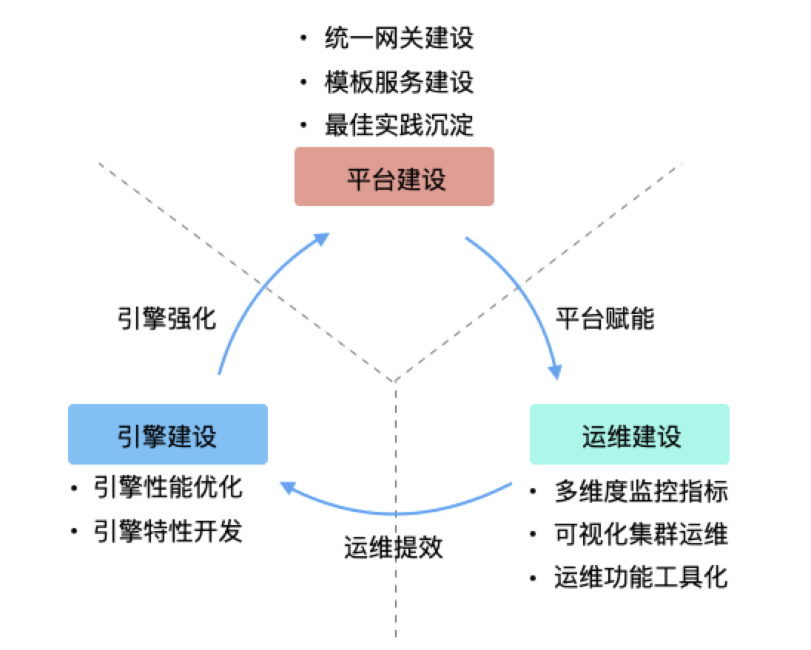
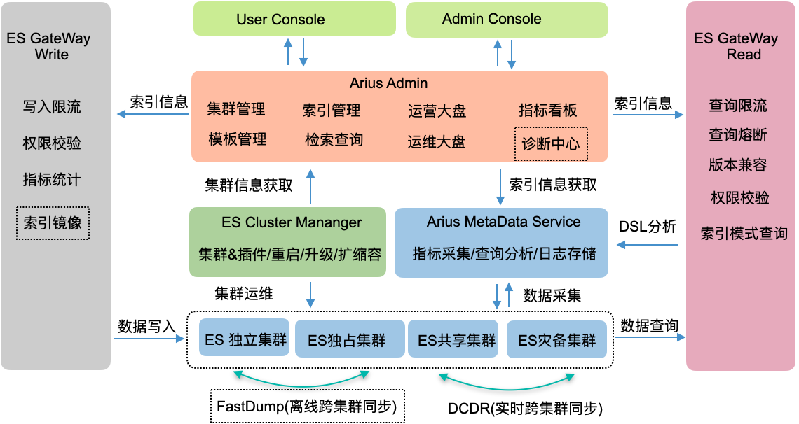

# 1. 背景介绍

Elasticsearch广泛应用于交易明细数据多维度近实时检索、海量日志探查与安全分析、企业SKU搜索与推荐等场景。随着读写业务量和集群索引与存储规模的增长，ES 使用和运维面临一系列问题，主要分为以下两类：

- 烟囱式集群构建
  - **技术架构门槛高**：版本选择、容量预估、部署架构设计，需要结合业务特点与引擎能力，深度洞察与持续运营
  - **数据建模门槛高**：数据建模需要深度ES索引原理掌控，结合业务特点，持续测试与数据探查，业界配套工具缺失
  - **学习掌控门槛高**：DSL语法复杂，过于灵活，版本兼容性差
- 探索式运维保障
  - **高可用体系缺失**：多活高可用、多集群管理、跨集群数据迁移能力缺失
  - **诊断体系缺失**：系统指标、日志指标、ES业务指标观测体系缺失**，**问题诊断低效

KnowSearch针对上述痛点，依托滴滴Elasticsearch多年企业级服务经验，结合金融级商业客户近千套ES集群运维实践迭代而来。在开源 Elasticsearch 基础上滴滴提供**离线索引快速迁移**、**索引跨集群复制**、**集群运维管理**的商业特性。

# 2.产品设计

## 2.1 核心概念

**我的集群与物理集群，解耦ES用户与ES运维**

- 物理集群：基于真实保障能力(资源类型、高可用手段、故障恢复预案、引擎掌控能力)，基于Region匹配业务诉求，是持续精进与运营的核心依赖
- 我的集群(逻辑集群)：表达业务场景（转化SLA需求）、资源规模诉求（资源规格澄清），将物理集群的节点资源以Region的形式划分并与租户的逻辑集群进行绑定
- 集群类型：**共享集群、独享集群、独立集群**

  - 共享、独享、独立是DataNode资源隔离、运维保障、高可用能力承载的解决方案层呈现，底层资源隔离类型变更对业务透明
    - 共享：DataNode组成一个Region在多个逻辑集群之间复用
    - 独享：一组DataNode组成一个Region被一个逻辑集群独占
    - 独立：一个物理集群唯一对应一个逻辑集群、实现DataNode、MasterNode的隔离
  - 用户参与度依次变高(感知业务监控，感知集群监控，参与资源变更，接收集群告警)，SLA逐级越高(99%->99.9%->99.95%)，自由与责任动态的均衡，随着平台能力越强，整体对用户的依赖与限制会逐渐降低

**索引模板与索引，解耦ES用户与ES运维保障**

- 索引模板是**资源治理的最小业务单元**，承载业务数据建模的核心抓手，平台资源管控的最小粒度
- 索引是ES集群原生能力的最小单元呈现，是ES运维保障的最小粒度

## 2.2 服务体系

滴滴内部从平台建设、运维建设、引擎建设三个方面着手，相互配合，相互递进，打造了一整套可见、可管、可控ES服务治理体系

### 2.2.1 平台建设

主要目标是降低用户使用门槛，沉淀用户最佳实践，以索引模板为核心，围绕企业级最佳实践构建整套服务体系

- 读写网关：读写 ES 网关提供了100%适配原生 ES RestClient 的接口功能，零侵入、插件化的进行了企业特性增强：查询/写入限流、权限校验、跨集群访问、DSL分析与管控。
- 索引模板：索引模板是用户索引需求表达的最小业务单元，规范用户使用，降低学习Mapping/Setting门槛，提供了 SQL/DSL数据探查、查询模板监控与诊断功能特性。

### 2.2.2 运维建设

主要目标是主动发现ES 集群潜在风险点，快速诊断ES线上问题，ES高频运维能力批量变更

- 多集群管理：全面纳管5.X之后ES版本，高频运维命令GUI化(_nodes/_stat分析、indices分析、shard分布、task分析、hot_thread分析、动态配置)、Sense查询、SearchProfile能力深度集成、节点列表与Region管理。
- 多集群监控：Dashboard围绕集群、节点、索引、网关维度，近30+高危风险点主动巡检；集群看板围绕集群、节点、索引、索引模板200+指标同环比多维度对比分析；网关看板围绕用户视角读写流量、查询语句流量与耗时，进行同环比多维度特征分析。
- 索引/索引模板管理：围绕索引模板，构建了索引预创建、过期删除、冷热分离、RollOver、DCDR的最佳实践，并支持批量变更；围绕索引高频操作，构建了RollOver、ForceMerge、Translog、Shrink、Split、索引开关、索引禁用读写GUI能力，并支持批量变更。

### 2.2.3 引擎建设

主要目标是Master性能与稳定性提升、索引高可用、索引跨集群快速迁移能力

- ES集群 master 节点性能优化：滴滴搜索团队针对 ES 集群 master 节点处理性能优化，使得单集群能支持大最大 shard 数从万级提升到十万级。
- 滴滴跨集群同步( DCDR )：滴滴搜索团队自研的跨集群同步能力，类似于 ES 官方的 CCR能力。
- 滴滴索引快速构建插件( FastIndex )：滴滴搜索团队自研的 TB 级别数据离线快速构建索引能力 。

# 3.应用架构

KnowSearch 的应用架构是一个典型的分层架构，在业务的具体设计和实现上我们分为以下几层：

- KnowSearch-Console ：遵从前后端分离架构，基于多租户、内置资源Owner和管理员两种角色，面向ES用户、ES运维，基于业务场景提供了可见、可管、可控的产品功能。
- KnowSearch-Admin：围绕资源管控（集群、索引、索引模板）、运维管理（安装、部署、升级、配置）、命令执行（zeus-agent）、通用安全（用户、角色、资源）进行领域进行建模。对外基于HTTP+Restful协议提供了核心领域服务。
- KnowSearch-GateWay：提供一个兼容 ES Restclient 接口的数据网关 ，零侵入、插件化的进行了企业特性增强：查询/写入限流、权限校验、跨集群访问、DSL分析与管控，详细设计参见《GateWay工程架构》。
- KnowSearch-AMS：围绕集群、节点、索引、索引模板，基于自研的分布式Job执行框架，对ES原生指标进行深度加工，产出了200+观测指标，详细设计参见[《KnowSearch指标系统详设》](./KnowSearch指标系统详设.md)

