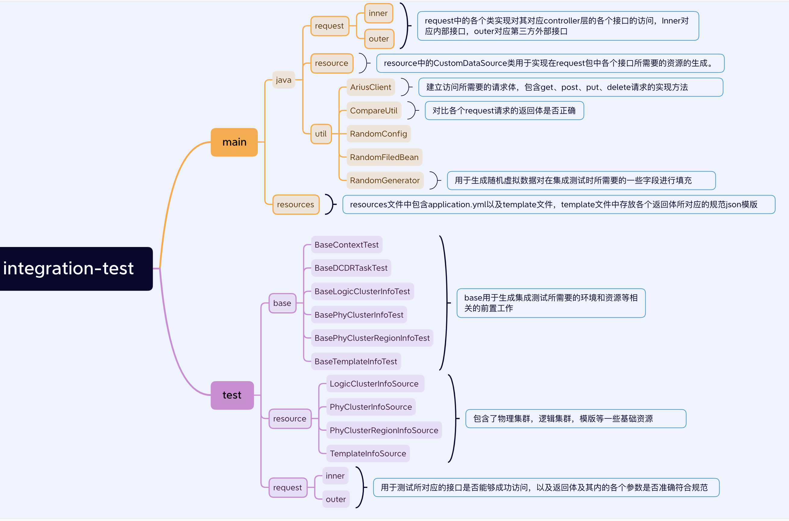

KnowSearch团队结合滴滴内部项目经验编写了集成测试规范文档，阅读本文档，您可以了解到KnowSearch项目的集成测试开发规范。

# 1.功能概述

## 1.1 需求整体介绍

### 1.1.1 集成测试定义及作用

集成测试，也称组装测试或联合测试。在单元测试的基础上，将所有模块按照设计要求（如根据结构图）组装成为子系统或系统，进行集成测试。实践表明，一些模块虽然能够单独地工作，但并不能保证连接起来也能正常的工作。一些局部反映不出来的问题，在全局上很可能暴露出来。集成测试分为两种集成模式：非渐增式集成渐增式集成：自顶向下集成，自底向上集成。

### 1.1.2 Knowsearch项目中编写集成测试的目的

本次集成测试开发旨在通过集成测试对**com.didichuxing.datachannel.arius.admin.rest.controller**中的各个接口**是否**能够**成功访问**以及通过该接口进行访问之后的**返回体是否正确,返回体中的各个参数是否符合标准**进行一个检验。

## 1.2 功能模块梳理

整个集成测试模块放至arius-admin-integration-test模块中，模块框架图如下:



### 1.2.1 补充说明

#### CompareUtil

该类中包含了

- 将类反序列化为json的函数

```
public static String serialize(Object object){
    // JSON对象序列化
    String objectJson = JSON.toJSONString(object, SerializerFeature.WRITE_MAP_NULL_FEATURES);
    return objectJson;
}
```

- 用于对比各个request请求的返回体是否正确。传递所对应接口的规范json的文件路径及返回体json，根据路径读取模版json，将模版json与返回体json进行比对，判断返回体中各个参数是否符合规范。以下分两种情况进行讨论：

1.若是自己编写返回体与模版json对比函数compareFunction，则在集成测试当中通过

customCompareJson(responseJsonString，templateJsonFile，compareFunction)调用CompareUtil中对应的customCompareJson函数，所对应的customCompareJson函数如下：

```
public static boolean customCompareJson(String responseJsonString, String templateJsonFile, BiFunction<String,String,Boolean> compareFunction ){
    return compareFunction.apply(responseJsonString,templateJsonFile);
}
```

2.直接调用CompareUtil中的compareJson函数来对比返回体json是否符合符合模版json规范，在集成测试中对应函数为compareJson(templateJsonFile,responseJsonString)，在CompareUtil中对应的compareJson函数对应如下：

```
public static boolean compareJson(String templateJsonFile,String responseJsonString) throws IOException {
//根据文件路径读取模版json
File file = ResourceUtils.getFile(templateJsonFile);
if (file == null){
LOGGER.error("class=CompareUtils||method=compareJson||errMsg=templateJsonFile is not found");
return false;
}
String templateJsonString = FileUtils.readFileToString(file, StandardCharsets.UTF_8);
//将返回体与json转换为Map形式方便比较对比
JSON templateJson = JSON.parseObject(templateJsonString);
JSON responseJson = JSON.parseObject(responseJsonString);
Map<String, Object> templateMap = new LinkedHashMap<>();
Map<String, Object> responseMap = new LinkedHashMap<>();
convertJsonToMap(templateJson, "", templateMap);
convertJsonToMap(responseJson, "", responseMap);
//调用CompareUtil中用于对比的compareMap函数
return compareMap(responseMap,templateMap);
}
```

#### 返回体json与其模版json的比对规则

将集成测试中的返回体json和其所对应的模版json进行比对，对于json中变化的key值采用**"\*"的模糊匹配处理**。查看返回体json是否拥有模版json所包含的所有key值,**若不包含所有key值则报错，对于模版json中key所映射的值为空的，返回体json可为空也可为非空，对于模版json中key所映射的值非空的，返回体json不能为空，否则报错。**

#### request包：

main中的request包用于存放对controller层接口进行访问的方法，与controller层接口一一对应，test中的request包调用这些方法实现访问测试，其中只**需要对outer包下的返回体进行规范测试。**

## 1.3 test举例

**举例1:**

```
@Test
public void testHeartbeat2() throws IOException {
Result<Integer> result = ThirdpartGatewayControllerMethod.heartbeat(phyClusterInfo.getPhyClusterName());

    Assert.assertTrue(result.success());
    Assert.assertTrue(result.getData()>=0);
}
```

上述例子中返回体为Integer类型，对应接口为gateway存活接口，因此首先需要校验其是否能够成功访问，进而校验返回值是否>=0，该测试通过则表示两个校验都成功验证通过。

**举例2：**

```
@Test
public void testListApp() throws IOException {
//调用main中的request方法去访问接口
Result<List<GatewayAppVO>> result = ThirdpartGatewayControllerMethod.listApp();
//查看是否访问成功
Assert.assertTrue(result.success());
//访问对应的模版json的文件夹。
String templateJsonFile = "src/main/resources/template.thirdpart.gateway/gatewayappvo.json";
//遍历返回体是否符合模版json
for (GatewayAppVO gatewayAppVO:result.getData()){
String responseJsonString = CompareUtil.serialize(gatewayAppVO);
Assert.assertTrue(CompareUtil.compareJson(templateJsonFile,responseJsonString));
}
}
```

上述例子中返回体为List<GatewayAppVO>，因此首先需要校验其是否能够成功访问，进而校验返回体是否符合规范，该测试通过则表示两个校验都成功验证通过。

# 2.代码及模块规范


- 代码符合web工程规范

- 模块规范参考模块框架图