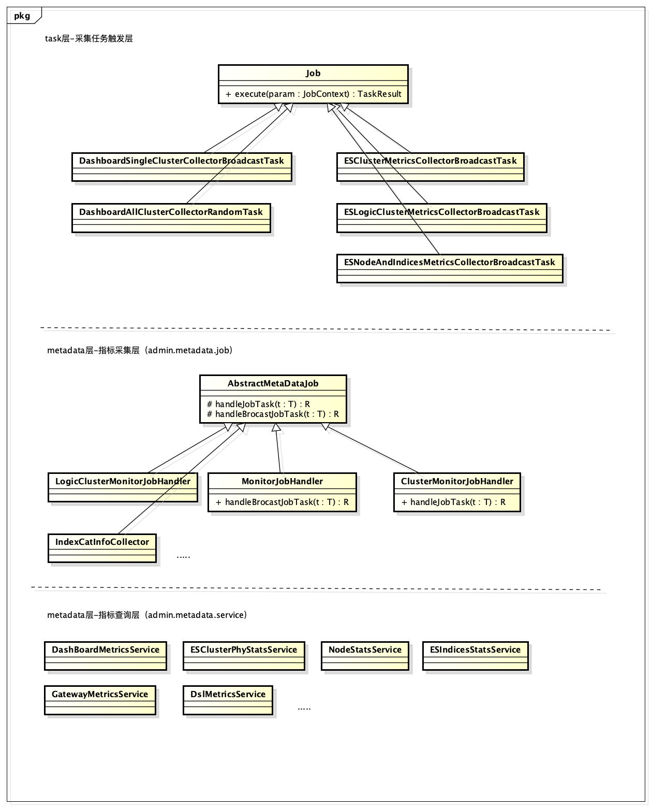
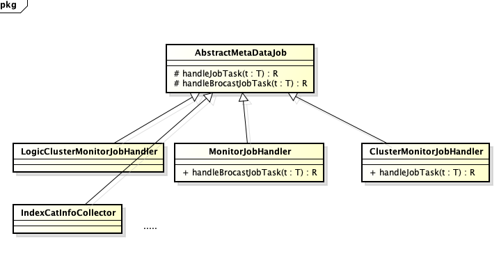
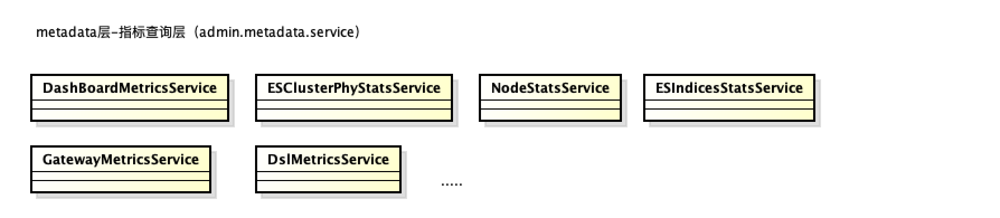
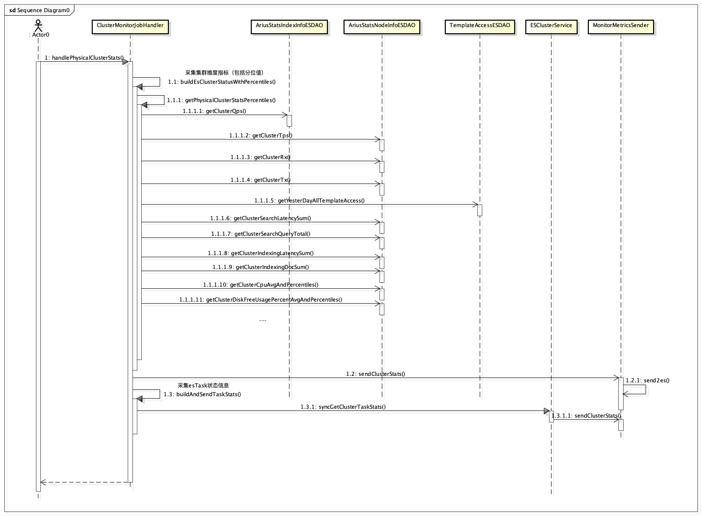
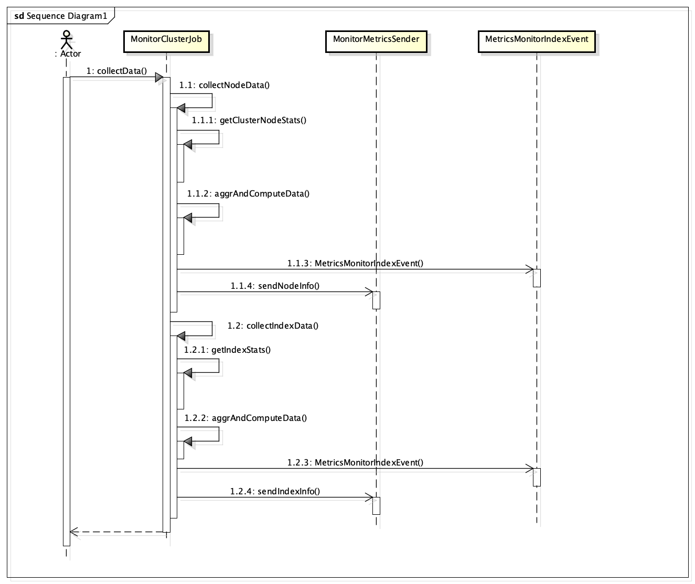
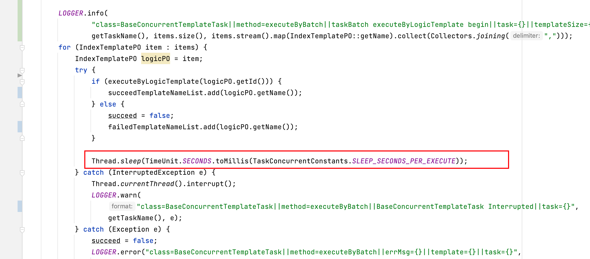
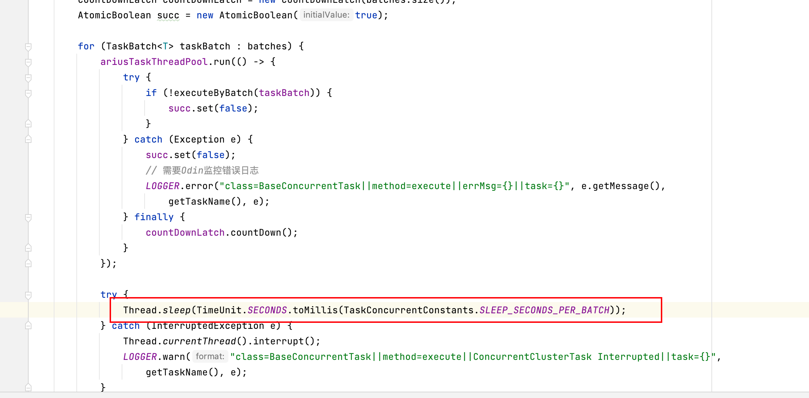

# 一、背景

目前普通用户或者运维同学对ES集群故障诊断、问题定位效率级低，加上ES上手成本较高，如何构建一套健壮且有效的可观测性系统来解决当下运维效率低下的问题显得尤为迫切，而业界围绕着Metrics、Log和Trace构建的可观察性系统中，Metrics作为核心的一环，其设计显得尤为重要，因此下文将针对Metrics的指标层面的设计来展开描述。

# 二、详设

Metrics 指标系统设计，围绕着采集端和查询端两个维度展开，从而解耦采集和查询逻辑，即提高系统扩展性又便于后期维护。其中，采集端负责查询ES内核指标，定义各种维度指标采集任务（Dashboard、集群、节点、索引等），对查询到的ES内核指标，在AMS系统中做二次加工处理，最后把加工后的数据结构化存储到ES中；查询端负责对采集端结构化到ES中指标数据进行查询分析，涉及DSL的编写，包括但不限于聚合查询（agg）、范围查询（range）等。下面将从核心UML类图、核心流程时序图、数据索引结构化建模等方面进行进一步设计。

## 01 核心UML类图

### 核心UML类图总览



核心UML包括三层维度介绍： 

1、task层，各种采集任务定时执行层，包括Dashboard、物理集群、逻辑集群、节点和索引等相关采集任务触发器。其中

Dashboard包括：

分布式指标采集器(负责广播采集多个集群指标信息)：DashboardSingleClusterCollectorBroadcastTask
        单机指标采集器(单机采集全量集群指标信息)：DashboardAllClusterCollectorRandomTask

物理集群包括：ESClusterMetricsCollectorBroadcastTask

逻辑集群包括：ESLogicClusterMetricsCollectorBroadcastTask

节点和索引包括：ESNodeAndIndicesMetricsCollectorBroadcastTask

2、采集层，负责各种具体的采集任务中的指标进行二次加工，结构化存储到ES。

3、查询层，负责对ES中的结构化数据进行查找分析，提供基础的指标查询能力。


### 采集端UML类图




其中AbstractMetaDataJob作为采集器的基类，各种类型采集器需要继承AbstractMetaDataJob，重点关注以下核心处理器：ClusterMonitorJobHandler（集群维度指标采集器）和 MonitorJobHandler（节点和索引指标采集器）。具体实现层面需要重点关注以下代码段：


**ClusterMonitorJobHandler**

```
1. 具体采集逻辑： ClusterMonitorJobHandler#handlePhysicalClusterStats
2. 采集分位指标逻辑代码段：
ClusterMonitorJobHandler#buildEsClusterStatusWithPercentiles
3. 采集指标上报其他监控系统逻辑：
metrics.MetricsMonitorClusterEvent
```


**MonitorJobHandler**

```
1. 采集注册器(注册需要采集的各种指标，重点关注索引维度、节点维度等注册器)
MonitorCollectMetrics#initIndexDataRegisterMap(索引维度注册器)
MonitorCollectMetrics#initNodeDataRegisterMap()(节点维度注册器)

2. 节点和索引具体采集逻辑
MonitorClusterJob#collectData
MonitorClusterJob#collectNodeData
MonitorClusterJob#collectIndexData
```


### 查询端UML类图



其中重点关注 DashBoardMetricsService、ESClusterPhyStatsService、NodeStatsService、ESIndicesStatsService，分别提供了DashBoard维度、物理集群维度、节点维度、索引维度等各种聚合查询的能力，如topN、各种分位值等。具体实现层面需要关注以下代码段：


**DashBoardMetricsService**

```
1. 获取dashboard大盘TopN指标信息
DashBoardMetricsService#getToNMetrics
2. 获取dashboard大盘list列表类指标信息
DashBoardMetricsService#getListValueMetrics
```


**ESClusterPhyStatsService**

```
1. 获取物理集群分位统计信息
ESClusterPhyStatsService#getAggPercentilesMetrics
2. 获取集群维度单指标信息
ESClusterPhyStatsService#getAggClusterPhyMetrics
```


**NodeStatsService**

```
1. 获取单个节点维度指标的 TopN 信息
NodeStatsService#getAggClusterPhyNodeMetrics
2. 获取节点任务信息指标 TopN 信息
NodeStatsService#getAggClusterPhyNodeTaskMetrics
```


**ESIndicesStatsService**

```
1. 获取单个索引维度指标的 TopN 信息
ESIndicesStatsService#getAggClusterPhyIndicesMetrics
2. 获取单个模板维度指标的 TopN 信息
ESIndicesStatsService#getAggClusterPhyTemplateMetrics
```


## 02 核心流程时序图

化繁为简，分离代码实现过程中的细枝末节，描述核心采集流程的处理过程。重点关注采集侧：物理集群维度指标采集流程，节点和索引维度指标采集流程等。查询侧较为简单这里不过多赘述，可以参考上述【核心UML类图》采集端】描述。

### 物理集群维度指标采集流程



其核心采集流程：

1、查询ES内核集群维度指标(_cluster/stats)。

2、对查询到的指标在AMS层做加工处理。

3、加工后的数据最后结构化存储于ES中。

### 节点和索引维度指标采集流程



其核心采集流程：

1、查询ES内核节点维度（_node/stats）和索引维度（{index}/stats）指标。

2、对查询到的指标在AMS层做加工处理。

3、加工后的数据最后结构化存储于ES中。

## 03 数据索引结构化建模

结构化建模，即是通过admin-ams查询采集二次加工的指标，存储到ES中数据格式的定义，也称为索引mapping定义，而索引setting多在调优层面的设置，这里不过多展开，其中，秉承着简洁清晰的原则，切勿对mapping过渡设计。以下给出Dashboard、集群、节点、索引等核心索引建模过程，其中指标的颗粒度由大到小，从全局到局部，Dashboard涉及多层mapping类型，详细设计如下。

### DashBoard索引Mapping信息

DashBoard模板名称为arius_stats_dashboard_info，Dashboard即大盘，将Dashboard划分为物理集群维度指标（cluster）、节点维度指标（node）、模板维度指标（template）、索引维度指标（index）、集群线程池指标（clusterThreadPoolQueue）、集群健康度指标（clusterPhyHealth）等，把各个维度的指标信息集成在arius_stats_dashboard_info，类似多张不同业务的表集成为大宽表，具体结构见下：


**Dashboard中物理集群维度指标信息**

```
"cluster": {
				"properties": {
					"indexReqNum": {
						"type": "long"
					},
					"cluster": {
						"type": "keyword"
					},
					"shardNum": {
						"type": "long"
					},
					"reqUprushNum": {
						"type": "long"
					},
					"gatewaySucPer": {
						"type": "double"
					},
					"pendingTaskNum": {
						"type": "long"
					},
					"searchLatency": {
						"type": "double"
					},
					"docUprushNum": {
						"type": "long"
					},
					"gatewayFailedPer": {
						"type": "double"
					},
					"indexingLatency": {
						"type": "double"
					},
					"httpNum": {
						"type": "long"
					},
					"clusterElapsedTime": {
						"type": "long"
					},
					"nodeElapsedTime": {
						"type": "long"
					},
					"collectorDelayed": {
						"type": "long"
					},
					"indexCount": {
						"type": "long"
					},
					"clusterElapsedTimeGte5Min": {
						"type": "boolean"
					},
					"timestamp": {
						"format": "epoch_millis",
						"type": "date"
					}
				}
   }
```


**Dashboard中节点维度指标信息**

```
"node": {
				"properties": {
					"largeHead": {
						"type": "double"
					},
					"cluster": {
						"type": "keyword"
					},
					"node": {
						"type": "keyword"
					},
					"shardNum": {
						"type": "long"
					},
					"taskConsuming": {
						"type": "long"
					},
					"largeDiskUsage": {
						"type": "double"
					},
					"searchRejectedNum": {
						"type": "long"
					},
					"largeCpuUsage": {
						"type": "double"
					},
					"writeRejectedNum": {
						"type": "long"
					},
					"dead": {
						"type": "boolean"
					},
					"SearchRejectedNum": {
						"type": "long"
					},
					"timestamp": {
						"format": "epoch_millis",
						"type": "date"
					}
				}
   }
```


**Dashboard中模板维度指标信息**

```
"template": {
				"properties": {
					"template": {
						"type": "keyword"
					},
					"cluster": {
						"type": "keyword"
					},
					"segmentMemSize": {
						"type": "double"
					},
					"templateName": {
						"type": "keyword"
					},
					"segmentNum": {
						"type": "long"
					},
					"templateId": {
						"type": "long"
					},
					"timestamp": {
						"format": "epoch_millis",
						"type": "date"
					}
				}
			}
```


**Dashboard中索引维度指标信息**

```
"index": {
				"properties": {
					"cluster": {
						"type": "keyword"
					},
					"mappingNum": {
						"type": "long"
					},
					"reqUprushNum": {
						"type": "long"
					},
					"segmentNum": {
						"type": "long"
					},
					"index": {
						"type": "keyword"
					},
					"red": {
						"type": "boolean"
					},
					"segmentMemSize": {
						"type": "float"
					},
					"smallShard": {
						"type": "boolean"
					},
					"docUprushNum": {
						"type": "long"
					},
					"bigShard": {
						"type": "boolean"
					},
					"shardSize": {
						"type": "long"
					},
					"shardNum": {
						"type": "long"
					},
					"singReplicate": {
						"type": "boolean"
					},
					"memSize": {
						"type": "double"
					},
					"timestamp": {
						"format": "epoch_millis",
						"type": "date"
					},
					"unassignedShard": {
						"type": "boolean"
					}
				}
			}
```


**Dashboard中集群线程池指标信息**

```
"clusterThreadPoolQueue": {
				"properties": {
					"cluster": {
						"type": "keyword"
					},
					"search": {
						"type": "long"
					},
					"flush": {
						"type": "long"
					},
					"management": {
						"type": "long"
					},
					"merge": {
						"type": "long"
					},
					"refresh": {
						"type": "long"
					},
					"write": {
						"type": "long"
					},
					"timestamp": {
						"format": "epoch_millis",
						"type": "date"
					}
				}
			}
```


**Dashboard中集群健康度指标**

```
"clusterPhyHealth": {
				"properties": {
					"unknownClusterListStr": {
						"type": "text"
					},
					"unknownNum": {
						"type": "long"
					},
					"redNum": {
						"type": "long"
					},
					"totalNum": {
						"type": "long"
					},
					"greenNum": {
						"type": "long"
					},
					"yellowClusterListStr": {
						"type": "text"
					},
					"yellowNum": {
						"type": "long"
					},
					"redClusterListStr": {
						"type": "text"
					},
					"timestamp": {
						"format": "epoch_millis",
						"type": "date"
					}
				}
			}
```


### 物理集群索引Mapping信息

模板名称为arius_stats_cluster_info，其集群维度的详细指标属性放置在statis mapping项中

```
"statis": {
	"properties": {
		"cpuUsage": {
			"type": "double"
		},
		"statusType": {
			"type": "long"
		},
		"numberPendingTasks": {
			"type": "long"
		},
		"searchLatency": {
			"type": "double"
		},
		"totalTemplateNu": {
			"type": "double"
		},
		"activeNodeNu": {
			"type": "long"
		},
		"invalidNodeNu": {
			"type": "long"
		},
		"clusterNu": {
			"type": "double"
		},
		"esNodeNu": {
			"type": "double"
		},
		"totalIndicesNu": {
			"type": "double"
		},
		"totalStoreSize": {
			"type": "double"
		},
		"level": {
			"type": "long"
		},
		"sla": {
			"type": "double"
		},
		"sendTransSize": {
			"type": "double"
		},
		"taskCount": {
			"type": "long"
		},
		"cpuLoad15M": {
			"type": "double"
		},
		"alivePercent": {
			"type": "long"
		},
		"shardNu": {
			"type": "double"
		},
		"freeStoreSize": {
			"type": "double"
		},
		"memUsed": {
			"type": "long"
		},
		"memFreePercent": {
			"type": "float"
		},
		"unAssignedShards": {
			"type": "long"
		},
		"appNu": {
			"type": "double"
		},
		"cpuLoad1M": {
			"type": "double"
		},
		"cpuLoad5M": {
			"type": "double"
		},
		"indexStoreSize": {
			"type": "double"
		},
		"totalDocNu": {
			"type": "double"
		},
		"extendInfoMap": {
			"type": "object"
		},
		"memUsedPercent": {
			"type": "float"
		},
		"clusterName": {
			"ignore_above": 512,
			"type": "keyword"
		},
		"storeSize": {
			"type": "double"
		},
		"indexingLatency": {
			"type": "double"
		},
		"key": {
			"ignore_above": 512,
			"type": "keyword"
		},
		"numberNodes": {
			"type": "long"
		},
		"recvTransSize": {
			"type": "double"
		},
		"memFree": {
			"type": "long"
		},
		"readTps": {
			"type": "double"
		},
		"memTotal": {
			"type": "long"
		},
		"numberDataNodes": {
			"type": "long"
		},
		"writeTps": {
			"type": "double"
		},
		"numberIngestNodes": {
			"type": "long"
		},
		"numberMasterNodes": {
			"type": "long"
		},
		"queryTimesPreDay": {
			"type": "double"
		},
		"taskCost": {
			"type": "double"
		},
		"numberClientNodes": {
			"type": "long"
		},
		"diskUsage": {
			"type": "double"
		}
	}
}
```


### 节点维度的索引mapping

模板名称为arius_stats_node_info，其节点维度的详细指标属性放置在metrics mapping项中

```
"metrics": {
	"properties": {
		"thread_pool-force_merge-queue": {
			"type": "double"
		},
		"indices-search-fetch_time_in_millis": {
			"type": "double"
		},
		"jvm-mem-heap_used_in_bytes": {
			"type": "double"
		},
		"thread_pool-bulk-queue": {
			"type": "double"
		},
		"indices-query_cache-miss_count": {
			"type": "double"
		},
		"indices-query_cache-hit_count": {
			"type": "double"
		},
		"os-cpu-load_average-5m": {
			"type": "double"
		},
		"process-cpu-percent": {
			"type": "double"
		},
		"indices-request_cache-memory_size_in_bytes": {
			"type": "double"
		},
		"indices-search-scroll_current": {
			"type": "double"
		},
		"indices-store-size_in_bytes": {
			"type": "double"
		},
		"indices-segments-count": {
			"type": "double"
		},
		"indices-merges-current": {
			"type": "double"
		},
		"indices-segments-breakers-fielddata-limit_size_in_bytes": {
			"type": "double"
		},
		"thread_pool-write-queue": {
			"type": "double"
		},
		"indices-search-scroll_total": {
			"type": "double"
		},
		"breakers-request-estimated_size_in_bytes": {
			"type": "double"
		},
		"transport-server_open": {
			"type": "double"
		},
		"breakers-in_flight_requests-limit_size_in_bytes": {
			"type": "double"
		},
		"indices-translog-uncommitted_size_in_bytes": {
			"type": "double"
		},
		"indices-query_cache-hit_rate": {
			"type": "double"
		},
		"indices-merges_avg_time": {
			"type": "double"
		},
		"indices-segments-index_writer_memory_in_bytes": {
			"type": "double"
		},
		"indices-request_cache-total_count": {
			"type": "double"
		},
		"indices-segments-term_vectors_memory_in_bytes": {
			"type": "double"
		},
		"thread_pool-refresh-queue": {
			"type": "double"
		},
		"indices-search-scroll_total_rate": {
			"type": "double"
		},
		"indices-merges-total": {
			"type": "double"
		},
		"indices-indexing-index_time_in_millis_rate": {
			"type": "double"
		},
		"indices-search-query_total_rate": {
			"type": "double"
		},
		"transport-tx_size_in_bytes_rate": {
			"type": "double"
		},
		"script-compilations": {
			"type": "double"
		},
		"fs-total-total_in_bytes": {
			"type": "double"
		},
		"os-cpu-load_average-15m": {
			"type": "double"
		},
		"thread_pool-search-completed": {
			"type": "double"
		},
		"http-current_open": {
			"type": "double"
		},
		"jvm-gc-young-collection_count_rate": {
			"type": "double"
		},
		"indices-index_latency": {
			"type": "double"
		},
		"jvm-mem-pools-old-used_in_bytes": {
			"type": "double"
		},
		"fs-total-disk_free_percent": {
			"type": "double"
		},
		"indices-search-fetch_total_rate": {
			"type": "double"
		},
		"thread_pool-bulk-rejected": {
			"type": "double"
		},
		"thread_pool-bulk-completed": {
			"type": "double"
		},
		"indices-query_latency": {
			"type": "double"
		},
		"thread_pool-search-rejected": {
			"type": "double"
		},
		"indices-search-query_time_per_query": {
			"type": "double"
		},
		"indices-docs-count": {
			"type": "double"
		},
		"indices-segments-memory_in_bytes": {
			"type": "double"
		},
		"jvm-gc-old-collection_avg_time": {
			"type": "double"
		},
		"indices-refresh_avg_time": {
			"type": "double"
		},
		"os-cpu_percent": {
			"type": "double"
		},
		"indices-request_cache-miss_count": {
			"type": "double"
		},
		"indices-search-fetch_total": {
			"type": "double"
		},
		"indices-search-scroll_avg_time": {
			"type": "double"
		},
		"jvm-mem-pools-young-used_in_bytes": {
			"type": "double"
		},
		"indices-flush_avg_time": {
			"type": "double"
		},
		"os-cpu-percent": {
			"type": "double"
		},
		"jvm-mem-heap_used_percent": {
			"type": "double"
		},
		"indices-segments-norms_memory_in_bytes": {
			"type": "double"
		},
		"indices-search-query_time_in_millis": {
			"type": "double"
		},
		"indices-query_cache-cache_size": {
			"type": "double"
		},
		"transport-rx_size_in_bytes_rate": {
			"type": "double"
		},
		"os-cpu-load_average-1m": {
			"type": "double"
		},
		"indices-segments-stored_fields_memory_in_bytes": {
			"type": "double"
		},
		"breakers-parent-limit_size_in_bytes": {
			"type": "double"
		},
		"jvm-gc-old-collection_count": {
			"type": "double"
		},
		"indices-search-fetch_time_per_fetch": {
			"type": "double"
		},
		"jvm-mem-non_heap_used_in_bytes": {
			"type": "double"
		},
		"indices-query_cache-evictions": {
			"type": "double"
		},
		"thread_pool-rollup_indexing-queue": {
			"type": "double"
		},
		"indices-request_cache-evictions": {
			"type": "double"
		},
		"indices-translog-operations_rate": {
			"type": "double"
		},
		"indices-indexing-index_total": {
			"type": "double"
		},
		"indices-search-query_time_in_millis_rate": {
			"type": "double"
		},
		"jvm-threads-count": {
			"type": "double"
		},
		"breakers-accounting-limit_size_in_bytes": {
			"type": "double"
		},
		"transport-rx_count_rate": {
			"type": "double"
		},
		"indices-indexing-index_time_in_millis": {
			"type": "double"
		},
		"jvm-gc-young-collection_avg_time": {
			"type": "double"
		},
		"transport-tx_count_rate": {
			"type": "double"
		},
		"indices-refresh-total_time_in_millis": {
			"type": "double"
		},
		"indices-flush-total": {
			"type": "double"
		},
		"breakers-fielddata-limit_size_in_bytes": {
			"type": "double"
		},
		"indices-merges-total_time_in_millis": {
			"type": "double"
		},
		"breakers-request-limit_size_in_bytes": {
			"type": "double"
		},
		"breakers-parent-estimated_size_in_bytes": {
			"type": "double"
		},
		"indices-indexing-delete_total_rate": {
			"type": "double"
		},
		"indices-docs-count_diff": {
			"type": "double"
		},
		"indices-segments-fixed_bit_set_memory_in_bytes": {
			"type": "double"
		},
		"indices-search-scroll_time_in_millis_rate": {
			"type": "double"
		},
		"thread_pool-management-queue": {
			"type": "double"
		},
		"jvm-gc-old-collection_time_in_millis": {
			"type": "double"
		},
		"indices-segments-doc_values_memory_in_bytes": {
			"type": "double"
		},
		"indices-indexing-index_total_rate": {
			"type": "double"
		},
		"indices-search-query_total": {
			"type": "double"
		},
		"indices-segments-points_memory_in_bytes": {
			"type": "double"
		},
		"indices-query_cache-memory_size_in_bytes": {
			"type": "double"
		},
		"ingest-total-failed": {
			"type": "float"
		},
		"indices-search-scroll_time_in_millis": {
			"type": "double"
		},
		"thread_pool-write-rejected": {
			"type": "double"
		},
		"process-process-open_file_descriptors": {
			"type": "double"
		},
		"breakers-accounting-estimated_size_in_bytes": {
			"type": "double"
		},
		"breakers-in_flight_requests-estimated_size_in_bytes": {
			"type": "double"
		},
		"indices-query_cache-total_count": {
			"type": "double"
		},
		"jvm-gc-young-collection_time_in_millis": {
			"type": "double"
		},
		"fs-total-available_in_bytes": {
			"type": "double"
		},
		"fs-total-free_in_bytes": {
			"type": "double"
		},
		"indices-indexing-index_time_per_doc": {
			"type": "double"
		},
		"jvm-gc-young-collection_count": {
			"type": "double"
		},
		"indices-refresh-total": {
			"type": "double"
		},
		"breakers-fielddata-estimated_size_in_bytes": {
			"type": "double"
		},
		"indices-flush-total_time_in_millis": {
			"type": "double"
		},
		"thread_pool-write-completed": {
			"type": "double"
		},
		"ingest-total-current": {
			"type": "float"
		},
		"ingest-total-count": {
			"type": "float"
		},
		"ingest-total-time_in_millis": {
			"type": "float"
		},
		"thread_pool-search-queue": {
			"type": "double"
		},
		"indices-request_cache-hit_rate": {
			"type": "double"
		},
		"indices-request_cache-hit_count": {
			"type": "double"
		},
		"indices-segments-version_map_memory_in_bytes": {
			"type": "double"
		},
		"indices-search-fetch_time_in_millis_rate": {
			"type": "double"
		},
		"jvm-gc-old-collection_count_rate": {
			"type": "double"
		}
	}
}
```


### 索引维度的索引mapping

模板名称为arius_stats_index_info，其索引维度的详细指标属性放置在metrics mapping项中

```
"metrics" : {
          "properties" : {
            "refresh-total" : {
              "type" : "double"
            },
            "cost_scroll_time_in_millis" : {
              "type" : "double"
            },
            "indexing-index_time_in_millis_rate" : {
              "type" : "double"
            },
            "store-size_in_bytes" : {
              "type" : "double"
            },
            "indexing-docs-count" : {
              "type" : "double"
            },
            "docs-count-total" : {
              "type" : "float"
            },
            "fielddata-memory_size_in_bytes" : {
              "type" : "double"
            },
            "search-fetch_time_in_millis" : {
              "type" : "double"
            },
            "search-query_time_in_millis_rate" : {
              "type" : "double"
            },
            "cost-refresh-total_time_in_millis" : {
              "type" : "double"
            },
            "merges-total" : {
              "type" : "double"
            },
            "segments-doc_values_memory_in_bytes" : {
              "type" : "double"
            },
            "segments_segments_request_cache_memory_size_in_bytes" : {
              "type" : "double"
            },
            "search-query_time_in_millis" : {
              "type" : "double"
            },
            "search-scroll_total" : {
              "type" : "double"
            },
            "cost-query_time_in_millis" : {
              "type" : "double"
            },
            "indexing-index_time_per_doc" : {
              "type" : "double"
            },
            "cost_index_time_in_millis" : {
              "type" : "double"
            },
            "segments-index_writer_memory_in_bytes" : {
              "type" : "double"
            },
            "indexing-index_total_rate" : {
              "type" : "double"
            },
            "segments-request_cache-memory_size_in_bytes" : {
              "type" : "double"
            },
            "cost-index_time_in_millis" : {
              "type" : "double"
            },
            "segments-memory_in_bytes" : {
              "type" : "double"
            },
            "store-size_in_bytes_rate" : {
              "type" : "double"
            },
            "query_cache-memory_size_in_bytes" : {
              "type" : "double"
            },
            "cost_refresh_total_time_in_millis" : {
              "type" : "double"
            },
            "segments_fielddata_memory_size_in_bytes" : {
              "type" : "double"
            },
            "cost-scroll_time_in_millis" : {
              "type" : "double"
            },
            "segments_fixed_bit_set_memory_in_bytes" : {
              "type" : "double"
            },
            "docs-count" : {
              "type" : "double"
            },
            "shardNu" : {
              "type" : "double"
            },
            "search-query_total_rate" : {
              "type" : "double"
            },
            "segments-version_map_memory_in_bytes" : {
              "type" : "double"
            },
            "refresh-total_time_in_millis" : {
              "type" : "double"
            },
            "search-scroll_time_in_millis_rate" : {
              "type" : "double"
            },
            "merges-total_rate" : {
              "type" : "double"
            },
            "segments_norms_memory_in_bytes" : {
              "type" : "double"
            },
            "cost_fetch_time_in_millis" : {
              "type" : "double"
            },
            "cost_query_time_in_millis" : {
              "type" : "double"
            },
            "flush-total" : {
              "type" : "double"
            },
            "cost_flush_total_time_in_millis" : {
              "type" : "double"
            },
            "search-fetch_total_rate" : {
              "type" : "double"
            },
            "refresh-total_rate" : {
              "type" : "double"
            },
            "segments_version_map_memory_in_bytes" : {
              "type" : "double"
            },
            "translog-size_in_bytes" : {
              "type" : "double"
            },
            "segments-count" : {
              "type" : "double"
            },
            "indices-search-query_avg_time" : {
              "type" : "double"
            },
            "flush-total_time_in_millis" : {
              "type" : "double"
            },
            "indexing-index_total" : {
              "type" : "double"
            },
            "indexing-index_time_in_millis" : {
              "type" : "double"
            },
            "search-fetch_time_in_millis_rate" : {
              "type" : "double"
            },
            "flush-total_rate" : {
              "type" : "double"
            },
            "indexing-index_total_times" : {
              "type" : "double"
            },
            "indices-merge_avg_time" : {
              "type" : "double"
            },
            "merges-current" : {
              "type" : "double"
            },
            "search-scroll_time_in_millis" : {
              "type" : "double"
            },
            "segments-fixed_bit_set_memory_in_bytes" : {
              "type" : "double"
            },
            "segments-breakers-fielddata-limit_size_in_bytes" : {
              "type" : "double"
            },
            "search-query_total" : {
              "type" : "double"
            },
            "indices-indexing-index_time_per_doc" : {
              "type" : "double"
            },
            "search-scroll_total_rate" : {
              "type" : "double"
            },
            "segments-points_memory_in_bytes" : {
              "type" : "double"
            },
            "cost_merges_total_time_in_millis" : {
              "type" : "double"
            },
            "indices-search-fetch_avg_time" : {
              "type" : "double"
            },
            "segments-norms_memory_in_bytes" : {
              "type" : "double"
            },
            "indices-indexing-index_latency" : {
              "type" : "float"
            },
            "segments-term_vectors_memory_in_bytes" : {
              "type" : "double"
            },
            "segments-stored_fields_memory_in_bytes" : {
              "type" : "double"
            },
            "store-size_in_bytes-total" : {
              "type" : "float"
            },
            "merges-total_time_in_millis" : {
              "type" : "double"
            },
            "indices-refresh_avg_time" : {
              "type" : "double"
            },
            "indexing-index_failed_rate" : {
              "type" : "double"
            },
            "search-fetch_total" : {
              "type" : "double"
            },
            "indices-search-scroll_avg_time" : {
              "type" : "double"
            },
            "indices-flush_avg_time" : {
              "type" : "double"
            }
          }
        }
```

# 三、展望/提升点

1、分层优化，建议admin-metadata和admin-task中存在各种各样的任务采集器，需要进行二次整合便于管理。

2、分布式定时调度器的优化，定时调度执行器的稳定性和准确性需要加强，特别在大量集群的场景下，分布式调度器的准确性和稳定性有待提升

3、物理集群的实现优化，借鉴节点维度和索引维度指标采集流程，具有较强的扩展性，且核心流程稳定，所以物理集群的实现需要进行优化。

4、代码精简、逻辑集群维度和物理集群维度指标采集器实现逻辑中有较多的重复代码，或者是可二次抽取复用的代码，需要从该方面进行代码精简。


# 四、设计实现FAQ

1、BaseConcurrentTemplateTask： 调整睡眠时间为 100ms，每个模版任务执行后睡眠三秒钟，有什么意义？



答：这里是缓解任务执行压力，因为这里模板任务的操作会涉及ES内核的元数据变更，变更过于频繁，会对平台稳定性造成影响。

2、BaseConcurrentTask 每个批次的任务加入线程池执行后睡眠两秒钟，有什么意义，是否有必要？



答：防止并发执行多个耗时较长的任务，导致cpu突发暴增，这里休眠使得cpu更为平滑。